---
## Front matter
lang: ru-RU
title: Первоначальна настройка git
subtitle: Лабораторная работа №2
author:
  - Никулина К. И.
institute:
  - Российский университет дружбы народов, Москва, Россия
date: 18 февраля 2023

## i18n babel
babel-lang: russian
babel-otherlangs: english

## Formatting pdf
toc: false
toc-title: Содержание
slide_level: 2
aspectratio: 169
section-titles: true
theme: metropolis
header-includes:
 - \metroset{progressbar=frametitle,sectionpage=progressbar,numbering=fraction}
 - '\makeatletter'
 - '\beamer@ignorenonframefalse'
 - '\makeatother'
backgroundColor: orange
---

# Информация

## Докладчик

:::::::::::::: {.columns align=center}
::: {.column width="60%"}

  * Никулина Ксения Ильинична
  * студент 1 курса, группа НММбд-02-22
  * Российский университет дружбы народов

:::
::: {.column width="40%"}

:::
::::::::::::::

# Вводная часть

## Объект и предмет исследования

- SCV git
- ПО для работы с git

## Цели работы

- Изучить идеологию и применение средств контроля версий.
- Освоить умения по работе с git.

## Задание
1. Установить и настроить ПО для работы с git.
2. Ответить на теоритические вопросы

# Выполнение лабораторной работы №2

## Установка программного обеспечения

:::::::::::::: {.columns align=center}

::: {.column width="50%"}

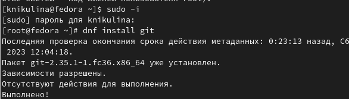

:::

::: {.column width="50%"}

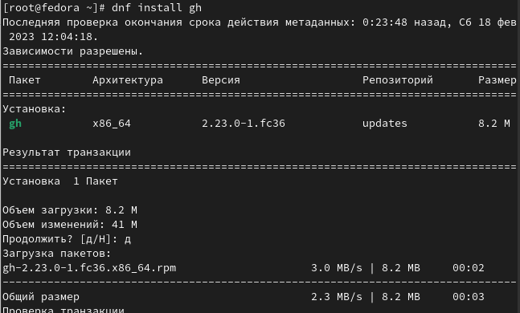

:::
::::::::::::::

## Базовая настройка git

:::::::::::::: {.columns align=center}

::: {.column width="50%"}

:::

::: {.column width="50%"}

:::

::::::::::::::

## Создали ключи ssh

:::::::::::::: {.columns align=center}

::: {.column width="50%"}

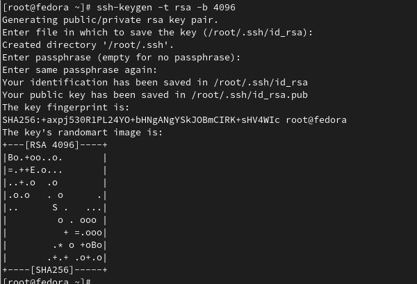

:::

::: {.column width="50%"}

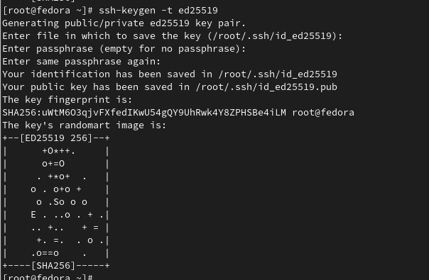

:::
::::::::::::::

## Создали ключи pgp

:::::::::::::: {.columns align=center}

::: {.column width="80%"}

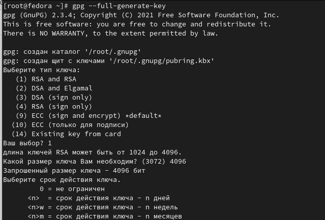

:::

::::::::::::::

## Настройка github

:::::::::::::: {.columns align=center}

::: {.column width="50%"}

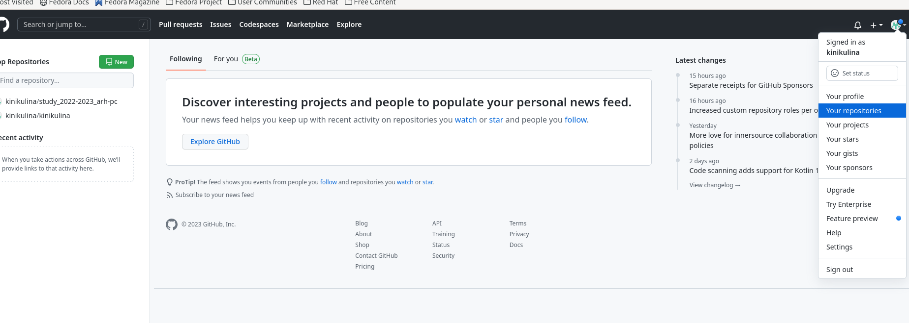

:::

::: {.column width="50%"}

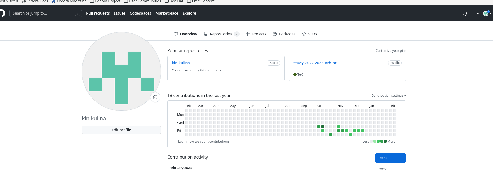

:::
::::::::::::::

## Добавление PGP ключа в GitHub

:::::::::::::: {.columns align=center}

::: {.column width="50%"}

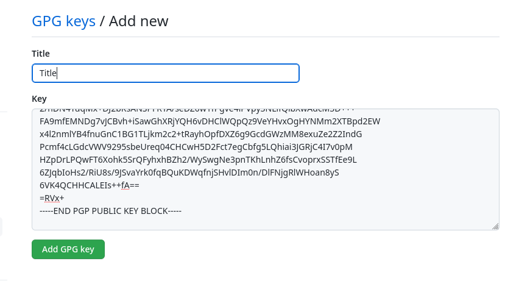

:::

::: {.column width="50%"}

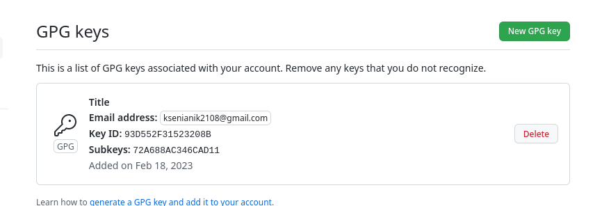

:::
::::::::::::::

## Настройка автоматических подписей коммитов git и gh

:::::::::::::: {.columns align=center}

::: {.column width="50%"}

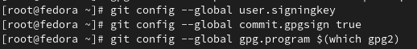

:::

::: {.column width="50%"}

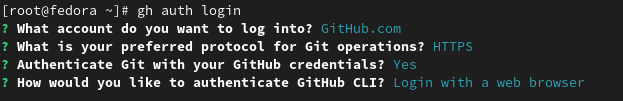

:::
::::::::::::::

## Сознание репозитория курса на основе шаблона

:::::::::::::: {.columns align=center}

::: {.column width="50%"}

Создали шаблон рабочего пространства.

:::

::: {.column width="50%"}

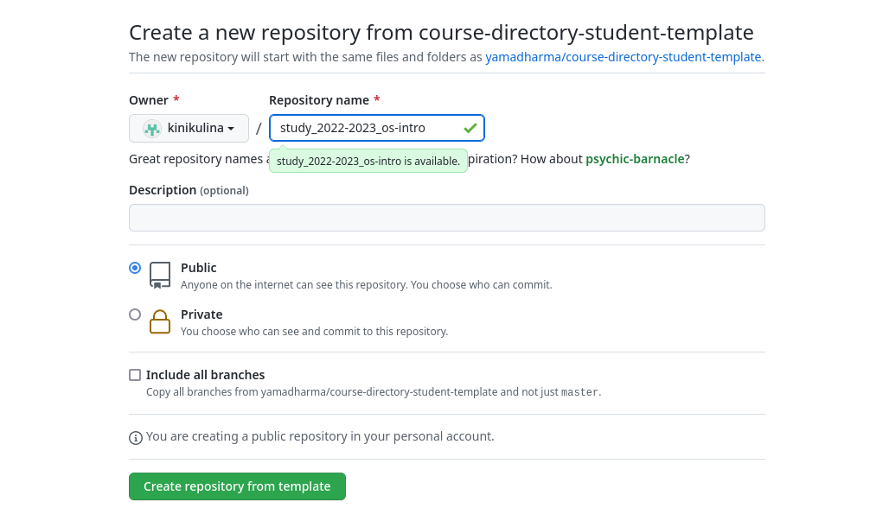

:::
::::::::::::::

## Настройка каталога курса

:::::::::::::: {.columns align=center}

::: {.column width="50%"}

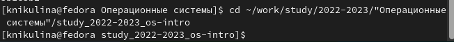

:::

::: {.column width="50%"}

:::
::::::::::::::

## Ответы на контрольные вопросы

:::::::::::::: {.columns align=center}

::: {.column width="50%"}

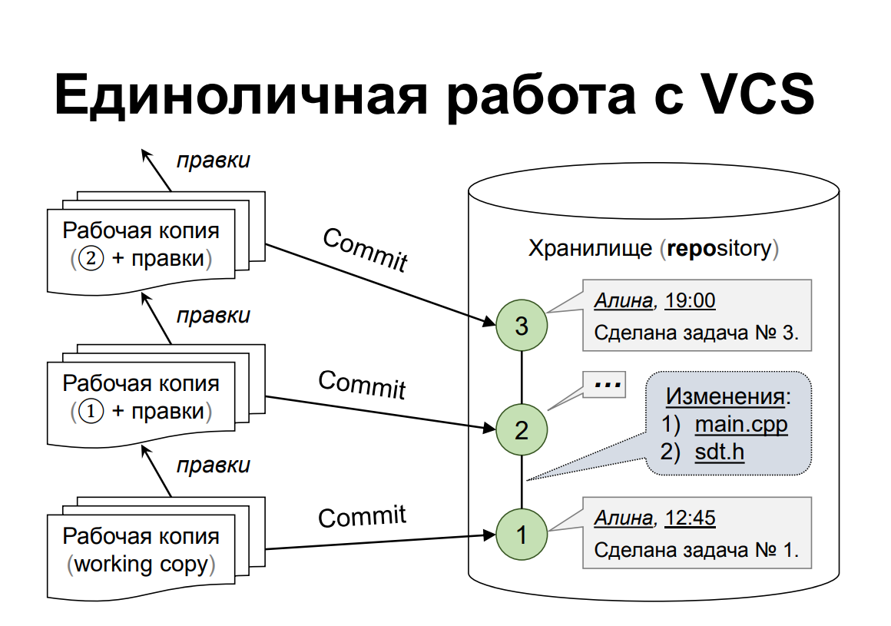

:::

::: {.column width="50%"}

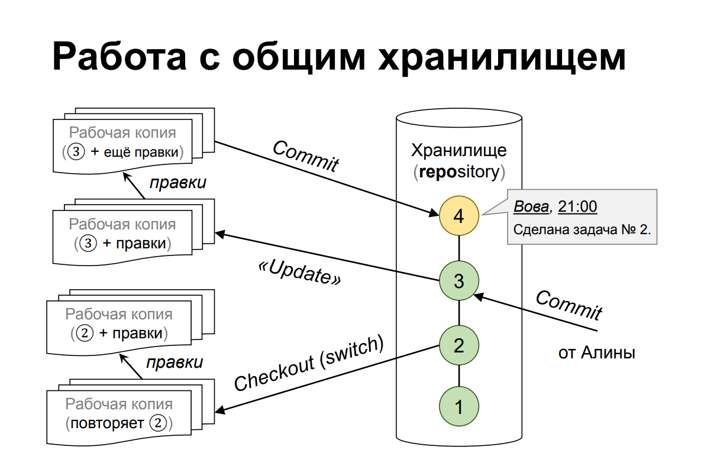

:::
::::::::::::::

# Результаты

## Выводы из лабораторной работы №2

В ходе выполнения данной лабораторной работы была изучена идеология и применение средств контроля версий и освоены умения по работе с git.

