---
## Front matter
title: "Отчёт по лабораторной работе № 2"
subtitle: "НММбд-02-22"
author: "Никулина Ксения Ильинична"

## Generic otions
lang: ru-RU
toc-title: "Содержание"

## Bibliography
bibliography: bib/cite.bib
csl: pandoc/csl/gost-r-7-0-5-2008-numeric.csl

## Pdf output format
toc: true # Table of contents
toc-depth: 2
lof: true # List of figures
fontsize: 12pt
linestretch: 1.5
papersize: a4
documentclass: scrreprt
## I18n polyglossia
polyglossia-lang:
  name: russian
  options:
	- spelling=modern
	- babelshorthands=true
polyglossia-otherlangs:
  name: english
## I18n babel
babel-lang: russian
babel-otherlangs: english
## Fonts
mainfont: PT Serif
romanfont: PT Serif
sansfont: PT Sans
monofont: PT Mono
mainfontoptions: Ligatures=TeX
romanfontoptions: Ligatures=TeX
sansfontoptions: Ligatures=TeX,Scale=MatchLowercase
monofontoptions: Scale=MatchLowercase,Scale=0.9
## Biblatex
biblatex: true
biblio-style: "gost-numeric"
biblatexoptions:
  - parentracker=true
  - backend=biber
  - hyperref=auto
  - language=auto
  - autolang=other*
  - citestyle=gost-numeric
## Pandoc-crossref LaTeX customization
figureTitle: "Рис."
tableTitle: "Таблица"
listingTitle: "Листинг"
lofTitle: "Список иллюстраций"
lolTitle: "Листинги"
## Misc options
indent: true
header-includes:
  - \usepackage{indentfirst}
  - \usepackage{float} # keep figures where there are in the text
  - \floatplacement{figure}{H} # keep figures where there are in the text
---

# Цель работы
- Изучить идеологию и применение средств контроля версий.
- Освоить умения по работе с git.

# Задание
- Установить и настроить ПО для работы с git.

# Выполнение лабораторной работы

## Установка программного обеспечения

Установили git:(рис. [-@fig:001]) 

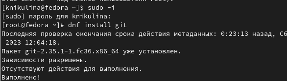{ #fig:001 width=70%}

Установили gh:(рис. [-@fig:002]) 

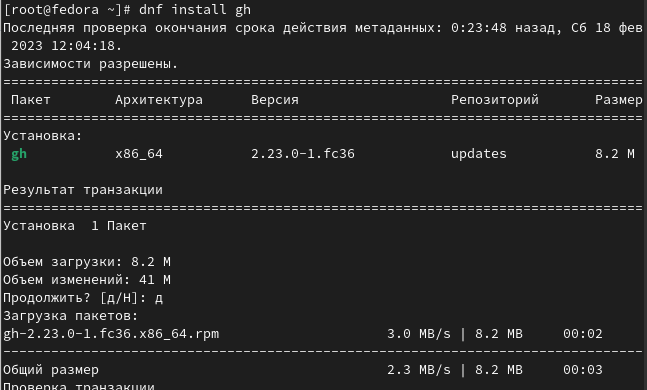{ #fig:002 width=70%}

## Базовая настройка git

Задали имя и email владельца репозитория: (рис. [-@fig:003]) 

{ #fig:003 width=70%}

Настроили utf-8 в выводе сообщений git:(рис. [-@fig:004]) 

{ #fig:004 width=70%}

Настроили верификацию и подписание коммитов git.
Задали имя начальной ветки (будем называть её master).(рис. [-@fig:005]) 

{ #fig:005 width=70%}

Параметр autocrlf:(рис. [-@fig:006]) 

{ #fig:006 width=70%}

Параметр safecrlf: (рис. [-@fig:007]) 

{ #fig:007 width=70%}

## Создали ключи ssh

по алгоритму rsa с ключём размером 4096 бит: (рис. [-@fig:008])

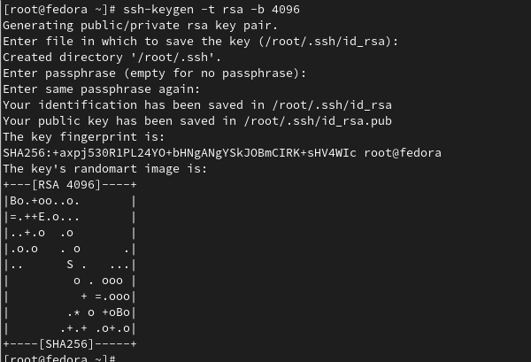{ #fig:008 width=70%}

по алгоритму ed25519: (рис. [-@fig:009])

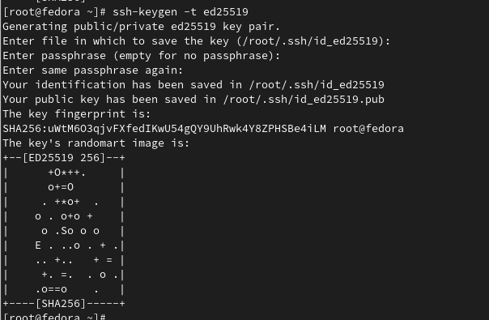{ #fig:009 width=70%}

## Создали ключи pgp

Сгенерировали ключ (рис. [-@fig:010])

Из предложенных опций выбирали:
тип RSA and RSA;
размер 4096;
выберали срок действия; значение по умолчанию — 0 (срок действия не истекает никогда).
GPG запросил личную информацию, которая сохранится в ключе:
Имя.
Адрес электронной почты.
При вводе email убедились, что он соответствует адресу, используемому на GitHub.
(рис. [-@fig:011])

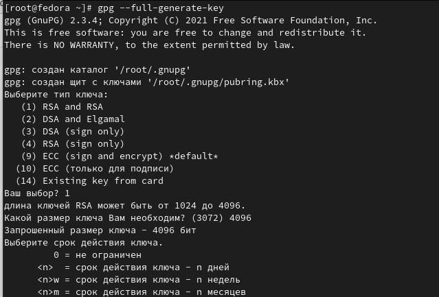{ #fig:010 width=70%}

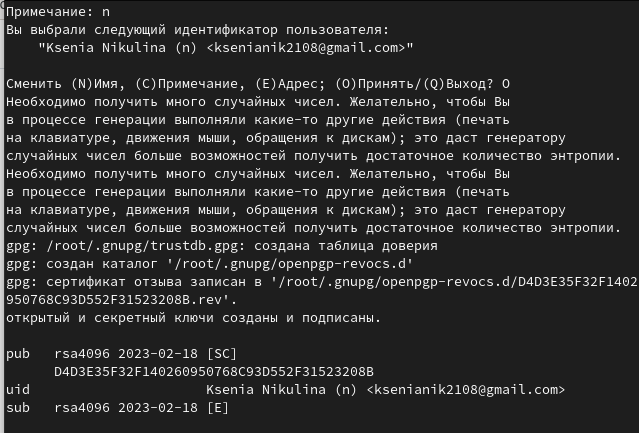{ #fig:011 width=70%}

## Настройка github

Создайте учётную запись на github.com. (рис. [-@fig:012])

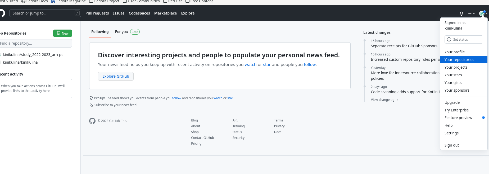{ #fig:012 width=70%}

Заполните основные данные на github.com. (рис. [-@fig:013])

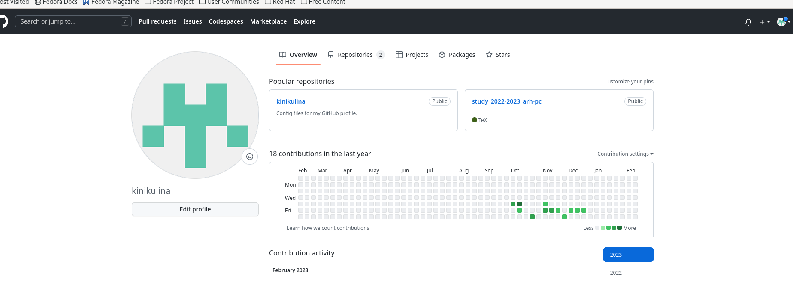{ #fig:013 width=70%}

## Добавление PGP ключа в GitHub

Вывели список ключей и копировали отпечаток приватного ключа: (рис. [-@fig:014])
Отпечаток ключа — это последовательность байтов, используемая для идентификации более длинного, по сравнению с самим отпечатком ключа.

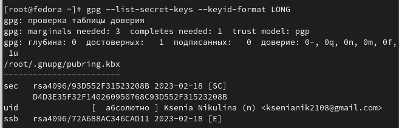{ #fig:014 width=70%}

Cкопировали сгенерированный PGP ключ в буфер обмена: (рис. [-@fig:015])

{ #fig:015 width=70%}

Перешли в настройки GitHub, нажали на кнопку New GPG key и вставили полученный ключ в поле ввода. (рис. [-@fig:016], [-@fig:017])

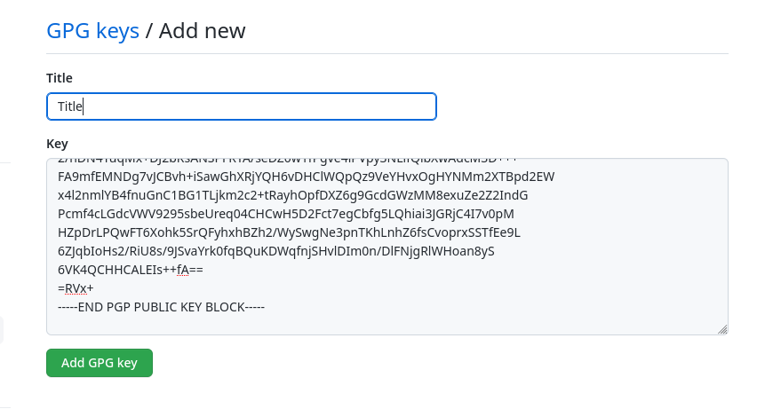{ #fig:016 width=70%}

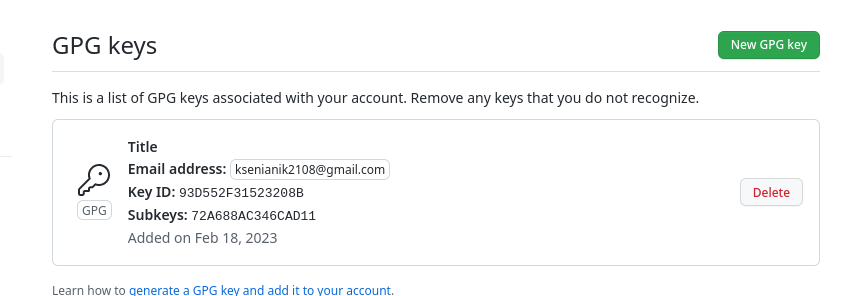{ #fig:017 width=70%}

## Настройка автоматических подписей коммитов git

Используя введёный email, указали Git применять его при подписи коммитов: (рис. [-@fig:018])

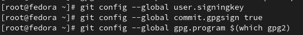{ #fig:018 width=70%}

## Настройка gh

Авторизовались в gh. (рис. [-@fig:019])
Утилита задали несколько наводящих вопросов.

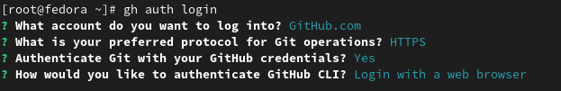{ #fig:019 width=70%}

## Сознание репозитория курса на основе шаблона

Создали шаблон рабочего пространства. (рис. [-@fig:020], [-@fig:021], [-@fig:022])

{ #fig:020 width=70%}

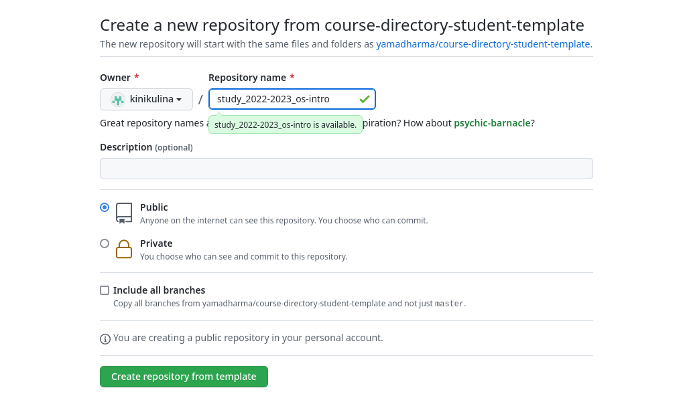{ #fig:021 width=70%}

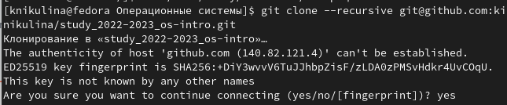{ #fig:022 width=70%}

## Настройка каталога курса

Перешли в каталог курса: (рис. [-@fig:023])

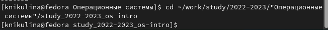{ #fig:023 width=70%}

Удалили лишние файлы: (рис. [-@fig:024])

{ #fig:024 width=70%}

Создали необходимые каталоги: (рис. [-@fig:025])

{ #fig:025 width=70%}

Отправили файлы на сервер: (рис. [-@fig:026], [-@fig:027])

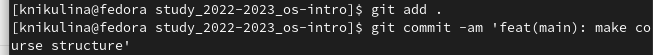{ #fig:026 width=70%}

{ #fig:027 width=70%}

# Выводы

В ходе выполнения данной лабораторной работы была изучена идеология и применение средств контроля версий и освоены умения по работе с git.

# Ответы на контрольные вопросы
1. Что такое системы контроля версий (VCS) и для решения каких задач они предназначаются?
Система управления версиями (также используется определение «система контроля версий», от англ. Version Control System, VCS или Revision Control System) — программное обеспечение для облегчения работы с изменяющейся информацией. Система управления версиями позволяет хранить несколько версий одного и того же документа, при необходимости возвращаться к более ранним версиям, определять, кто и когда сделал то или иное изменение, и многое другое.

2. Объясните следующие понятия VCS и их отношения: хранилище, commit, история, рабочая копия.
 Хранилище (repository), или репозитарий, —
место хранения файлов и их версий, служебной информации.
 Версия (revision), или ревизия, —
состояние всего хранилища или отдельных файлов
в момент времени («пункт истории»).
 Commit («трудовой вклад», не переводится) —
процесс создания новой версии; иногда синоним версии.
 Рабочая копия (working copy) —
текущее состояние файлов проекта (любой версии),
полученных из хранилища и, возможно, измененных.
	
3. Что представляют собой и чем отличаются централизованные и децентрализованные VCS? Приведите примеры VCS каждого вида.
  Децентрализованные VCS:
 У каждого пользователя свой вариант (возможно не
один) репозитория
 Присутствует возможность добавлять и забирать
изменения из любого репозитория
( Git, Mercurial,Bazaar)

 Централизованные VCS :
 Одно основное хранилище всего проекта
 Каждый пользователь копирует себе необходимые ему
файлы из этого репозитория, изменяет и, затем,
добавляет свои изменения обратно
(Subversion, CVS, TFS, VAULT, AccuRev)

4. Опишите действия с VCS при единоличной работе с хранилищем. (рис. [-@fig:028])

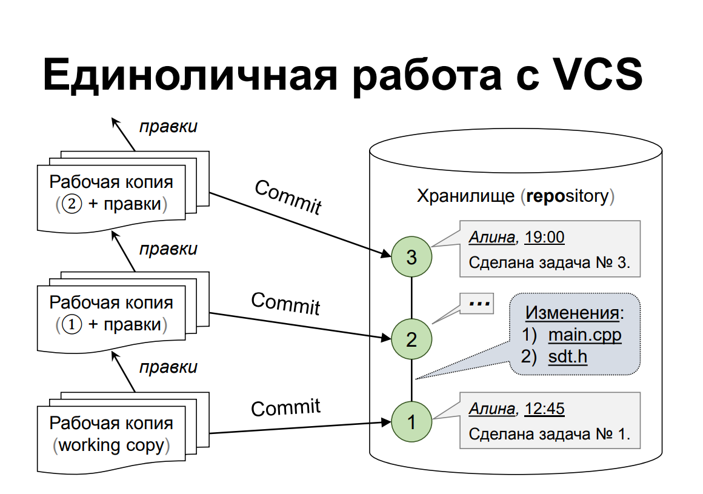{ #fig:028 width=70%}

5. Опишите порядок работы с общим хранилищем VCS. (рис. [-@fig:029])

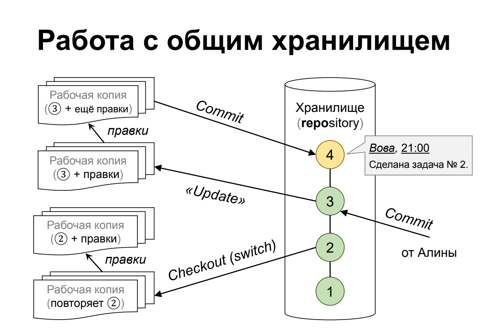{ #fig:029 width=70%}

6. Каковы основные задачи, решаемые инструментальным средством git?
	У Git две основных задачи: первая — хранить информацию о всех изменениях в вашем коде, начиная с самой первой строчки, а вторая — обеспечение удобства командной работы над кодом.
7. Назовите и дайте краткую характеристику командам git.
 git init - создание репозитория
 git add (имена файлов) - Добавляет файлы в индекс
 git commit – выполняет коммит проиндексированных
файлов в репозиторий
 git status – показывает какие файлы изменились между
текущей стадией и HEAD. Файлы разделяются на 3
категории: новые файлы, измененные файлы,
добавленные новые файлы
 git checkout (sha1 или метка) - получение указанной
версии файла
 git push – отправка изменений в удаленный репозиторий
 git fetch – получение изменений из удаленного
репозитория
 git clone (remote url) - клонирование удаленного
репозитория себе

8. Приведите примеры использования при работе с локальным и удалённым репозиториями. (рис. [-@fig:030])

{ #fig:030 width=70%}

9. Что такое и зачем могут быть нужны ветви (branches)?

Ветка (англ. branch) — это последовательность коммитов, в которой ведётся параллельная разработка какого-либо функционала Основная ветка– master Ветки в GIT. Показать все ветки, существующие в репозитарии git branch. Создать ветку git branch имя.

Ветки нужны, чтобы несколько программистов могли вести работу над одним и тем же проектом или даже файлом одновременно, при этом не мешая друг другу. Кроме того, ветки используются для тестирования экспериментальных функций: чтобы не повредить основному проекту, создается новая ветка специально для экспериментов.

10. Как и зачем можно игнорировать некоторые файлы при commit?
Игнорируемые файлы — это, как правило, артефакты сборки и файлы, генерируемые машиной из исходных файлов в вашем репозитории, либо файлы, которые по какой-либо иной причине не должны попадать в коммиты. Вот некоторые распространенные примеры таких файлов:

 кэши зависимостей, например содержимое node_modules или packages;
 скомпилированный код, например файлы .o, .pyc и .class ;
 каталоги для выходных данных сборки, например bin, out или target;
 файлы, сгенерированные во время выполнения, например .log, .lock или .tmp;
 скрытые системные файлы, например .DS_Store или Thumbs.db;
 личные файлы конфигурации IDE, например .idea.workspace.xml.
	
	
