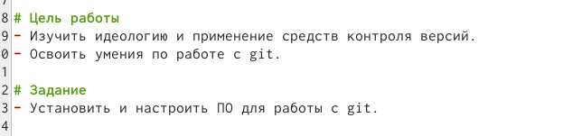
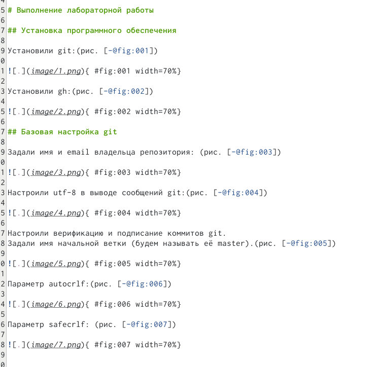
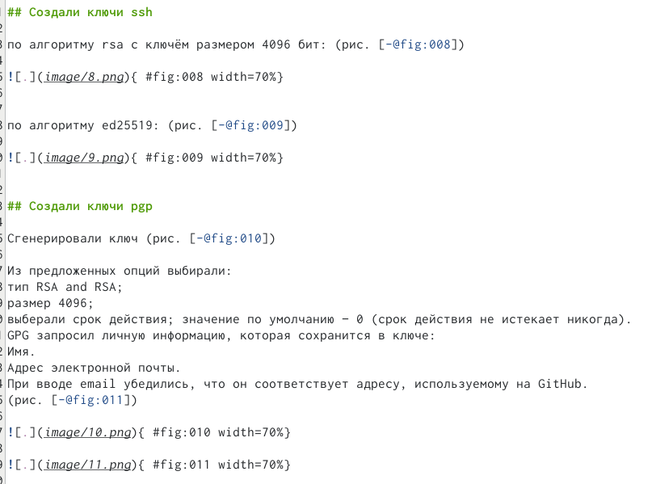
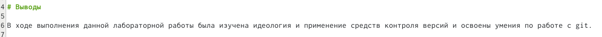
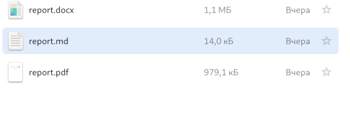

---
## Front matter
lang: ru-RU
title: Markdown
subtitle: Лабораторная работа № 3
author:
  - Никулина К.И.
institute:
  - Российский университет дружбы народов, Москва, Россия
date: 25 января 2023

## i18n babel
babel-lang: russian
babel-otherlangs: english

## Formatting pdf
toc: false
toc-title: Содержание
slide_level: 2
aspectratio: 169
section-titles: true
theme: metropolis
header-includes:
 - \metroset{progressbar=frametitle,sectionpage=progressbar,numbering=fraction}
 - '\makeatletter'
 - '\beamer@ignorenonframefalse'
 - '\makeatother'
---

# Информация

## Докладчик

:::::::::::::: {.columns align=center}
::: {.column width="70%"}

  * Никулина Ксения Илинична
  * студент 1 курса, группа НММбд-02-22
  * Российский университет дружбы народов

# Вводная часть

## Цели и задачи

 - Научиться оформлять отчеты с помощью легковесного языка разметки Markdown. 
 - Сделать отчет по лабораторной работе № 2 с помощью легковесного языка разметки Markdown. 

# Выполнение лабораторной работы №2

## Титульный лист

:::::::::::::: {.columns align=center}

::: {.column width="50%"}

:::
::::::::::::::

## Цель и задание

:::::::::::::: {.columns align=center}

::: {.column width="80%"}

:::
::::::::::::::

## Выполнение лабораторной работы

:::::::::::::: {.columns align=center}

::: {.column width="50%"}

:::

::: {.column width="50%"}

:::
::::::::::::::

## Вывод

:::::::::::::: {.columns align=center}

::: {.column width="80%"}

:::
::::::::::::::

## Ответы на вопросы

:::::::::::::: {.columns align=center}

::: {.column width="80%"}

:::
::::::::::::::

## Компелирование
:::::::::::::: {.columns align=center}

::: {.column width="80%"}

:::
::::::::::::::

# Результаты

## Выводы из лабораторной работы №3

В ходе выполнения данной лабораторной работы я научилась оформлять отчеты с помощью легковесного языка разметки Markdown. 

