---
## Front matter
title: "Отчёт по лабораторной работе №5"
subtitle: "Операционные системы"
author: "Никулина Ксения Ильинична"

## Generic otions
lang: ru-RU
toc-title: "Содержание"

## Bibliography
bibliography: bib/cite.bib
csl: pandoc/csl/gost-r-7-0-5-2008-numeric.csl

## Pdf output format
toc: true # Table of contents
toc-depth: 2
lof: true # List of figures
lot: true # List of tables
fontsize: 12pt
linestretch: 1.5
papersize: a4
documentclass: scrreprt
## I18n polyglossia
polyglossia-lang:
  name: russian
  options:
	- spelling=modern
	- babelshorthands=true
polyglossia-otherlangs:
  name: english
## I18n babel
babel-lang: russian
babel-otherlangs: english
## Fonts
mainfont: PT Serif
romanfont: PT Serif
sansfont: PT Sans
monofont: PT Mono
mainfontoptions: Ligatures=TeX
romanfontoptions: Ligatures=TeX
sansfontoptions: Ligatures=TeX,Scale=MatchLowercase
monofontoptions: Scale=MatchLowercase,Scale=0.9
## Biblatex
biblatex: true
biblio-style: "gost-numeric"
biblatexoptions:
  - parentracker=true
  - backend=biber
  - hyperref=auto
  - language=auto
  - autolang=other*
  - citestyle=gost-numeric
## Pandoc-crossref LaTeX customization
figureTitle: "Рис."
tableTitle: "Таблица"
listingTitle: "Листинг"
lofTitle: "Список иллюстраций"
lotTitle: "Список таблиц"
lolTitle: "Листинги"
## Misc options
indent: true
header-includes:
  - \usepackage{indentfirst}
  - \usepackage{float} # keep figures where there are in the text
  - \floatplacement{figure}{H} # keep figures where there are in the text
---

# Цель работы

Ознакомление с файловой системой Linux, её структурой, именами и
содержанием каталогов. Приобретение практических навыков по применению команд для работы с файлами и каталогами, по управлению процессами (и работами), по проверке использования диска и обслуживанию файловой системы.

# Выполнение лабораторной работы

1. Выполним дейсвтия, которые описаны в первой части лабораторной работы. (рис. @fig:001), (рис. @fig:002), (рис. @fig:003)

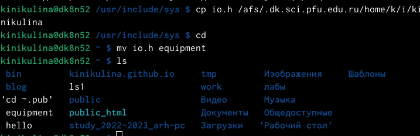{#fig:001 width=70%}

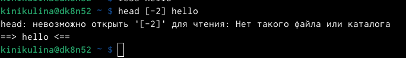{#fig:002 width=70%}

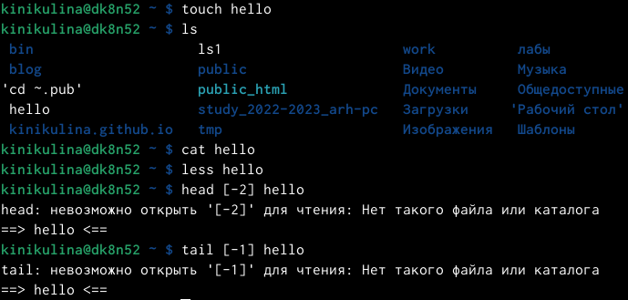{#fig:003 width=70%}

2. 2.1-2.8. (рис. @fig:004),(рис. @fig:005), (рис. @fig:006), (рис. @fig:007)

- Копируем файл /usr/include/aio.hв домашний каталог (команда «cp /usr/include/io.h ~») и назоваем его equipment (команда «mv io.h equipment»).

- В домашнем каталоге создаем директорию ~/ski.plases (команда «mkdir ski.plases»).
Перемещаем файл equipment в каталог ~/ski.plases (команда «mv equipment ski.plases»).

- Переименовываем файл ~/ski.plases/equipment в ~/ski.plases/equiplist (команда «mv ski.plases/equipment ski.plases/equiplist»).

- Создаем в домашнем каталоге файл abc1 (команда «touch abc1») и копируем его в каталог ~/ski.plases (команда «cp abc1 ski.plases»), называем его equiplist2 (команда «mv ski.plases/abc1 ski.plases/equiplist2»).

- Создаем каталог с именем equipment в каталоге ~/ski.plases (команда «mkdir ski.plases/equipment»).

- Перемещаем файлы ~/ski.plases/equiplist и equiplist2 в каталог ~/ski.plases/equipment (команда «mv ski.plases/equiolist ski.plases/equiplist2 ski.plases/equipment»).

- Создаем (команда «mkdir newdir») и перемещаем каталог ~/newdir в каталог ~/ski.plases (команда «mv newdir ski.plases») и называем его plans (команда «mv ski.plases/newdir ski.plases/plans»)

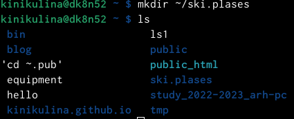{#fig:004 width=70%}

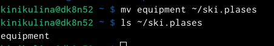{#fig:005 width=70%}

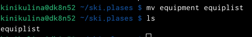{#fig:006 width=70%}

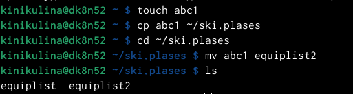{#fig:007 width=70%}

3. Определяем опции команды chmod, необходимые для того, чтобы присвоить соответствующим файлам выделенные права доступа, считая, что в начале таких прав нет. Предварительно создаем необходимые файлы, используя команды: «mkdir australia», «mkdir play», «touch my_os», «touch feathers» (рис. @fig:005)

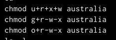{#fig:005 width=70%}

Затем используем команды (рис. @fig:006)

drwxr--r-- ... australia: команда «chmod 744 australia»,

drwx--x--x ... play: команда «chmod 711 play», 

-r-xr--r-- ... my_os: команды «chmod 544 my_os»,

-rw-rw-r-- ... feathers: команды «chmod 664 feathers». 

Командой ls проверяем правильность действий.

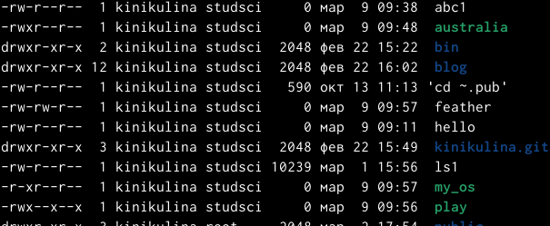{#fig:006 width=70%}

4. Затем просмотрим содержимое файла /etc/passwd (команда «cat /etc/passwd»).(рис. @fig:007).

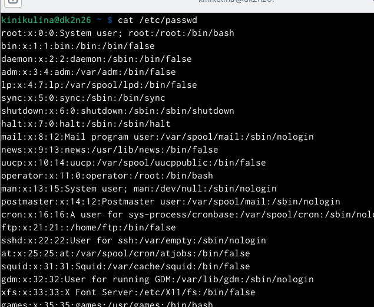{#fig:007 width=70%}

- Копируем файл ~/feathers в файл ~/file.old (команда «cp feathers file.old»).

- Переместим файл ~/file.old в каталог ~/play (команда «mv file.ord play»).
Скопируем каталог ~/play в каталог ~/fun (команда «cp -r play fun»).

- Переместим каталог ~/fun в каталог ~/play (команда «mv fun play») и назовем его games (команда «mv play/fun play/games»).

- Лишим владельца файла ~/feathers права на чтение (команда «chmod u-r feathers»).

- Если мы попытаемся просмотреть файл ~/feathers командой cat, то получим отказ в доступе, т.к. в предыдущем пункте лишили владельца права на чтение данного файла.

- Если мы попытаемся скопировать файл ~/feathers, например, в каталог monthly, то получим отказ в доступе, по причине, описанной в предыдущем пункте.

- Дадим владельцу файла ~/feathers право на чтение (команда «chmod u+r feathers»).

- Лишим владельца каталога ~/play права на выполнение (команда «chmod u-x play»).

- Перейдем в каталог ~/play (команда «cd play»). 
Получим отказ в доступе, т.к. в предыдущем пункте лишили владельца права на выполнение данного каталога.

- Дадим владельцу каталога ~/play право на выполнение (команда «chmod u+x play»)(рис. @fig:008).

{#fig:008 width=70%}

5. Используя команды «man mount», «man fsck», «man mkfs», «man kill», получим информацию о соответствующих командах:

- Команда mount: предназначена для монтирования файловой системы. Все файлы, доступные в Unix системах, составляют иерархическую файловую структуру, которая имеет ветки (каталоги) и листья (файлы в каталогах). Корень этого дерева обозначается как /. Физически файлы могут располагаться на различных устройствах. Команда mount служит для подключения файловых систем разных устройств к этому большому дереву. (рис. @fig:009)

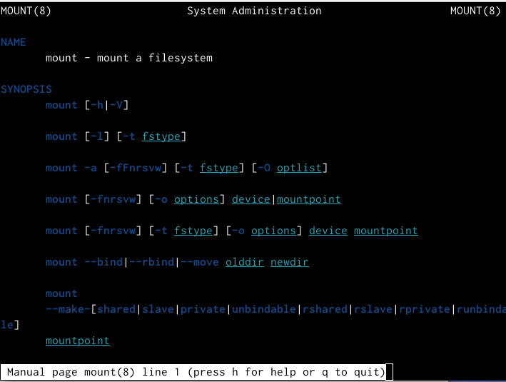{#fig:009 width=70%}

- Команда fsck: это утилита командной строки, которая позволяет выполнять проверки согласованности и интерактивное исправление в одной или нескольких файловых системах Linux. Он использует программы, специфичные для типа файловой системы, которую он проверяет. У команды fsck следующий синтаксис: fsck [параметр] -- [параметры ФС] [<файловая система> . . .] Например, если нужно восстановить («починить») файловую систему на некотором устройстве /dev/sdb2, следует воспользоваться командой: «sudo fsck -y /dev/sdb2» (рис. @fig:010)

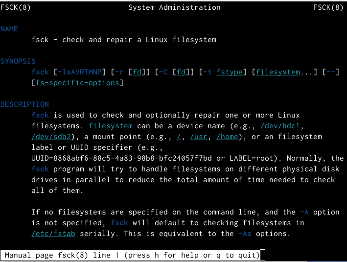{#fig:010 width=70%}

- Команда mkfs: создаёт новую файловую систему Linux. Имеет следующий синтаксис: mkfs [ -V ] [ -t fstype ] [ fs-options ] filesys [ blocks ] mkfs используется для создания файловой системы Linux на некотором устройстве, обычно в разделе жёсткого диска. В качестве аргумента filesys для файловой системы может выступать или название устройства (например, /dev/hda1, /dev/sdb2) или точка монтирования (например, /, /usr, /home).(рис. @fig:011)

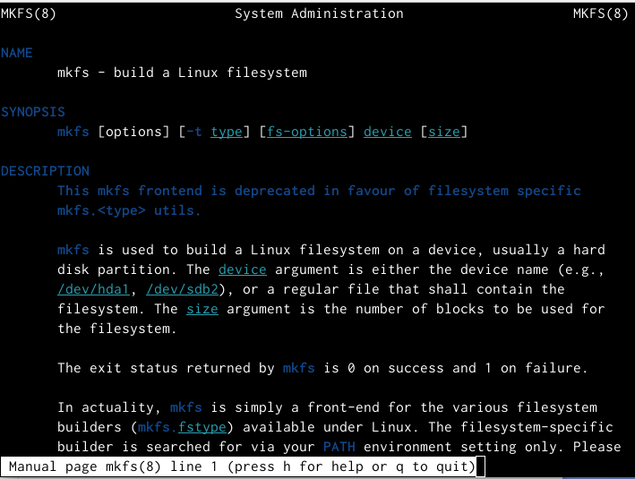{#fig:011 width=70%}

- Команда kill: посылает сигнал процессу или выводит список допустимых сигналов. Имеет следующий синтаксис: kill [опции] PID, где PID – это PID (числовой идентификатор) процесса или несколько PID процессов, если требуется послать сигнал сразу нескольким процессам. Например, команда «kill -KILL 3121» посылает сигнал KILL процессу с PID 3121, чтобы принудительно завершить процесс (рис. @fig:012)

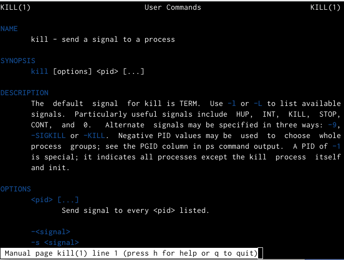{#fig:012 width=70%}

# Вывод 

В ходе выполнения данной лабораторной работы я ознакомилась с файловой системой Linux, её структурой, именами и содержанием каталогов, получила навыки по применению команд для работы с файлами и каталогами, по управлению процессами (и работами), по проверке использования диска и обслуживанию файловой системы.

# Ответы на контрольные вопросы

1. Чтобы узнать, какие файловые системы существуют на жёстком диске моего компьютера, использую команду «df -Th» (Рисунок 15). Из рисунка видно, что на моем компьютере есть следующие файловые системы: devtmpfs, tmpfs, ext4, iso9660. devtmpfs позволяет ядру создать экземпляр tmpfs с именем devtmpfs при инициализации ядра, прежде чем регистрируется какое-либо устройство с драйверами. Каждое устройство с майором / минором будет предоставлять узел устройства в devtmpfs. devtmpfs монтируется на /dev и содержит специальные файлы устройств для всех устройств. tmpfs − временное файловое хранилище во многих Unix-подобных ОС. Предназначена для монтирования файловой системы, но размещается в ОЗУ вместо ПЗУ. Подобная конструкция является RAM диском. Данная файловая система также предназначенная для быстрого и ненадёжного хранения временных данных. Хорошо подходит для /tmp и массовой сборки пакетов/образов. Предполагает наличие достаточного объёма виртуальной памяти. Файловая система tmpfs предназначена для того, чтобы использовать часть физической памяти сервера как обычный дисковый раздел, в котором можно сохранять данные (чтение и запись). Поскольку данные размещены в памяти, то чтение или запись происходят во много раз быстрее, чем с обычного HDD диска. ext4 − имеет обратную совместимость с предыдущими версиями ФС. Эта версия была выпущена в 2008 году. Является первой ФС из «семейства» Ext, использующая механизм «extent file system», который позволяет добиться меньшей фрагментации файлов и увеличить общую производительность файловой системы. Кроме того, в Ext4 реализован механизм отложенной записи (delayed allocation − delalloc), который так же уменьшает фрагментацию диска и снижает нагрузку на CPU. С другой стороны, хотя механизм отложенной записи и используется во многих ФС, но в силу сложности своей реализации он повышает вероятность утери данных. Характеристики: • максимальный размер файла: 16 TB; • максимальный размер раздела: 16 TB; • максимальный размер имени файла: 255 символов. Рекомендации по использованию: • наилучший выбор для SSD; • наилучшая производительность по сравнению с предыдущими Etx- системами; • она так же отлично подходит в качестве файловой системы для серверов баз данных, хотя сама система и моложе Ext3. ISO 9660 − стандарт, выпущенный Международной организацией по стандартизации, описывающий файловую систему для дисков CD- ROM. Также известен как CDFS (Compact Disc File System). Целью стандарта является обеспечить совместимость носителей под разными операционными системами, такими, как Unix, Mac OS, Windows.

2. Файловая система Linux/UNIX физически представляет собой пространство раздела диска разбитое на блоки фиксированного размера, кратные размеру сектора − 1024, 2048, 4096 или 8120 байт. Размер блока указывается при создании файловой системы. В файловой структуре Linux имеется один корневой раздел − / (он же root, корень). Все разделы жесткого диска (если их несколько) представляют собой структуру подкаталогов, "примонтированных" к определенным каталогам

3. Чтобы содержимое некоторой файловой системы было доступно операционной системе необходимо воспользоваться командой mount.

4. Целостность файловой системы может быть нарушена из-за перебоев в питании, неполадок в оборудовании или из-за некорректного/внезапного выключения компьютера. Чтобы устранить повреждения файловой системы необходимо использовать команду fsck.

5. Файловую систему можно создать, используя команду mkfs. Ее краткое описание дано в пункте 5) в ходе выполнения заданий лабораторной работы.

6. Для просмотра текстовых файлов существуют следующие команды: Задача команды cat очень проста − она читает данные из файла или стандартного ввода и выводит их на экран. Синтаксис утилиты: cat [опции] файл1 файл2 ... Основные опции: -b – нумеровать только непустые строки -E – показывать символ $ в конце каждой строки -n – нумеровать все строки -s – удалять пустые повторяющиеся строки -T – отображать табуляции в виде ^I -h – отобразить справку -v – версия утилиты Команда nl действует аналогично команде cat, но выводит еще и номера строк в столбце слева. Cущественно более развитая команда для пролистывания текста. При чтении данных со стандартного ввода она создает буфер, который позволяет листать текст как вперед, так и назад, а также искать как по направлению к концу, так и по направлению к началу текста. Синтаксис аналогичный синтаксису команды cat. Некоторые опции: -g – при поиске подсвечивать только текущее найденное слово (по умолчанию подсвечиваются все вхождения) -N – показывать номера строк Команда head выводит начальные строки (по умолчанию − 10) из одного или нескольких документов. Также она может показывать данные, которые передает на вывод другая утилита. Синтаксис аналогичный синтаксису команды cat. Основные опции: -c (--bytes) − позволяет задавать количество текста не в строках, а в байтах -n (--lines) − показывает заданное количество строк вместо 10, которые выводятся по умолчанию -q (--quiet, --silent) − выводит только текст, не добавляя к нему название файла -v (--verbose) − перед текстом выводит название файла -z (--zero-terminated) − символы перехода на новую строку заменяет символами завершения строк

Эта команда позволяет выводить заданное количество строк с конца файла, а также выводить новые строки в интерактивном режиме. Синтаксис аналогичный синтаксису команды cat. Основные опции: -c − выводить указанное количество байт с конца файла -f − обновлять информацию по мере появления новых строк в файле -n − выводить указанное количество строк из конца файла --pid − используется с опцией -f, позволяет завершить работу утилиты, когда завершится указанный процесс -q − не выводить имена файлов --retry − повторять попытки открыть файл, если он недоступен -v − выводить подробную информацию о файле

7. Утилита cp позволяет полностью копировать файлы и директории. Cинтаксис: cp [опции] файл-источник файл-приемник После выполнения команды файл-источник будет полностью перенесен в файл-приемник. Если в конце указан слэш, файл будет записан в заданную директорию с оригинальным именем. Основные опции: --attributes-only − не копировать содержимое файла, а только флаги доступа и владельца -f, --force − перезаписывать существующие файлы -i, --interactive − спрашивать, нужно ли перезаписывать существующие файлы -L − копировать не символические ссылки, а то, на что они указывают -n − не перезаписывать существующие файлы -P − не следовать символическим ссылкам -r − копировать папку Linux рекурсивно -s − не выполнять копирование файлов в Linux, а создавать символические ссылки -u − скопировать файл, только если он был изменён -x − не выходить за пределы этой файловой системы -p − сохранять владельца, временные метки и флаги доступа при копировании -t − считать файл-приемник директорией и копировать файл-источник в эту директорию

8. Команда mv используется для перемещения одного или нескольких файлов (или директорий) в другую директорию, а также для переименования файлов и директорий. Синтаксис: mv [-опции] старый_файл новый_файл Основные опции: --help − выводит на экран официальную документацию об утилите --version − отображает версию mv -b − создает копию файлов, которые были перемещены или перезаписаны -f − при активации не будет спрашивать разрешение у владельца файла, если речь идет о перемещении или переименовании файла -i − наоборот, будет спрашивать разрешение у владельца -n − отключает перезапись уже существующих объектов --strip-trailing-slashes — удаляет завершающий символ / у файла при его наличии -t [директория] — перемещает все файлы в указанную директорию -u − осуществляет перемещение только в том случае, если исходный файл новее объекта назначения -v − отображает сведения о каждом элементе во время обработки команды Команда rename также предназначена, чтобы переименовать файл. Синтаксис: rename [опции] старое_имя новое_имя файлы Основные опции: -v − вывести список обработанных файлов -n − тестовый режим, на самом деле никакие действия выполнены не будут -f − принудительно перезаписывать существующие файлы

9. Права доступа − совокупность правил, регламентирующих порядок и условия доступа субъекта к объектам информационной системы (информации, её носителям, процессам и другим ресурсам) установленных правовыми документами или собственником, владельцем информации. Права доступа к файлу или каталогу можно изменить, воспользовавшись командой chmod. Сделать это может владелец файла (или каталога) или пользователь с правами администратора. Синтаксис команды: chmod режим имя_файла Режим имеет следующие компоненты структуры и способ записи: = установить право лишить права дать право r чтение w запись x выполнение u (user) владелец файла g (group) группа, к которой принадлежит владелец файла o (others) все остальные
