---
## Front matter
lang: ru-RU
title: Презентация по лабораторной работе №6
subtitle: Операционные системы
author:
  - Никулина Ксения Ильинична, НММбд-02-22
institute:
  - Российский университет дружбы народов, Москва, Россия
date: 03 марта 2023

## i18n babel
babel-lang: russian
babel-otherlangs: english

## Formatting pdf
toc: false
toc-title: Содержание
slide_level: 2
aspectratio: 169
section-titles: true
theme: metropolis
header-includes:
 - \metroset{progressbar=frametitle,sectionpage=progressbar,numbering=fraction}
 - '\makeatletter'
 - '\beamer@ignorenonframefalse'
 - '\makeatother'
---

# Цель работы

Ознакомиться с инструментами поиска файлов и фильтрации текстовых данных.
Приобрести практические навыков: по управлению процессами (и заданиями), по
проверке использования диска и обслуживанию файловых систем.

## Выполнение лабораторной работы

1. Осуществили вход в систему, используя наше имя.

2. Далее запишем в файл *file.txt* названия файлов, содержащихся в каталоге */etc*. Для этого используем команду *ls -a /etc >file.txt*. С помощью команды *ls -a ~ - >> file.txt* дописываем в этот же файл названия файлов, содержащихся в домашнем каталоге. Для проверки действий испольузем команду *cat file.txt*.

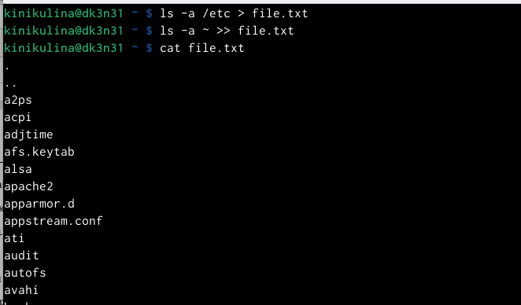{#fig:001 width=40%}

##

3. Нужно вывести имена всех файлов из *file.txt*, которые имею расширение *.conf* и записать их в новый текстовый файл *conf.txt*. Для этого используем команду *grep -e '\.conf$' file.txt > conf.txt*. Проверяем выполнение дейсвтий. 

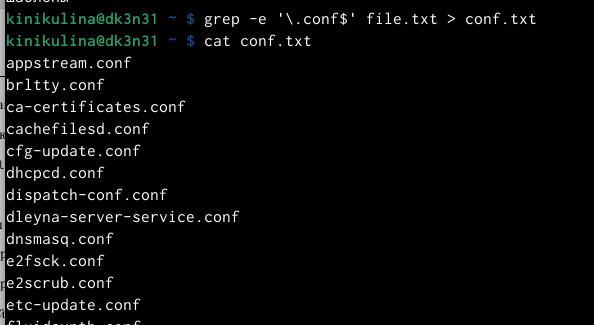{#fig:002 width=40%}

##

4. Затем найдём файлы в домашнем каталоге, которые начинаются на *с*. Это можно сделать несколькими командами, которые представлены на рисунке.

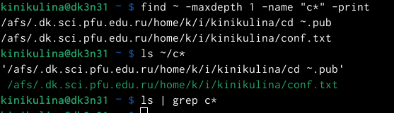{#fig:003 width=40%}

##

5. После этого выведем на экран (по странично) имена файлов из каталога */etc*, которые начинаются с символа *h*. Для этого я использовала команду * find /etc –maxdepth1 –name “h*”| less*. 

{#fig:004 width=40%}

##

6. Запустим в фоновом режиме процесс, который будет записывать в файл *~/logfile*, файлы, которые начинаются с *log* с помощью команды *find / -name “log*” > logfile&»*. Запустился беспрерывный процесс записывания файла. 

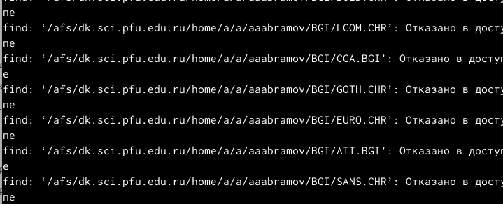{#fig:005 width=40%}

##

7. Проверим наличие файла *logfile*, а затем с помощью команды *rm logfile* удалим его. 

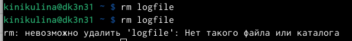{#fig:006 width=40%}

##

8. Заупскаем в консоли в фоном режиме редактор *gedit*. После ввода команды *gedit &* появляется окно редактора.

{#fig:007 width=40%}

##

9. Для определения идентификатора процесса *gedit* используем команду *ps | grep-i "gedit"*. Из рисунка видно, что наш процесс имеет PID 4507.

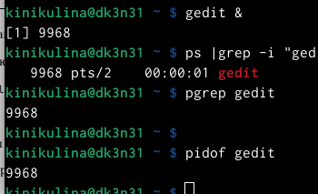{#fig:008 width=40%}

##

10. Далее ознакомимся со справкой команды *kill* и используем её для завершения процесса *gedit*. 

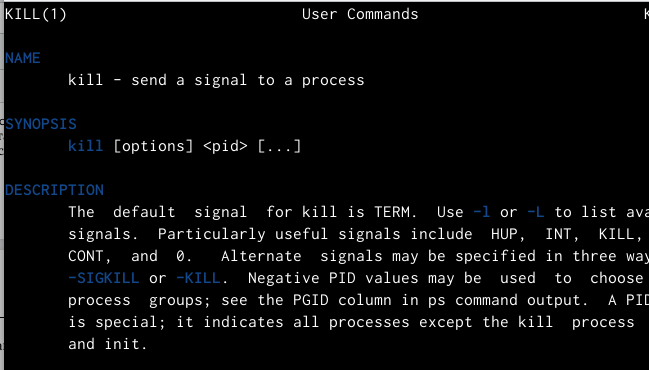{#fig:009 width=40%}

{#fig:010 width=40%}

##

11. Далее получим более подробную инофрмацию о командах *df* и *du*.
- df– утилита, показывающая список всех файловых систем по именам устройств, сообщает их размер, занятое и свободное пространство и точки монтирования.

- du – утилита, предназначенная для вывода ин-
формации об объеме дискового пространства, занятого файлами и директориями.Она принимает путь к элементу файловой системы и выводит информацию о
количестве байт дискового пространства или блоков диска, задействованных для его хранения

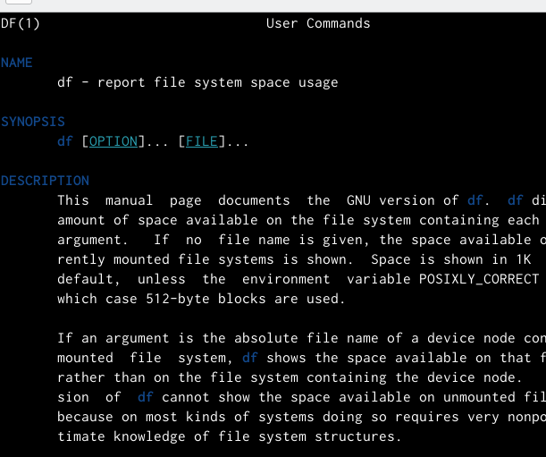{#fig:011 width=40%}

##

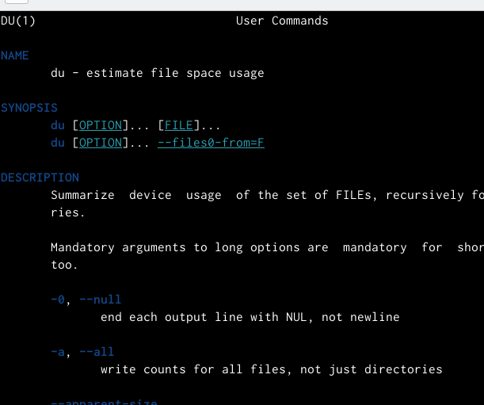{#fig:012 width=40%}

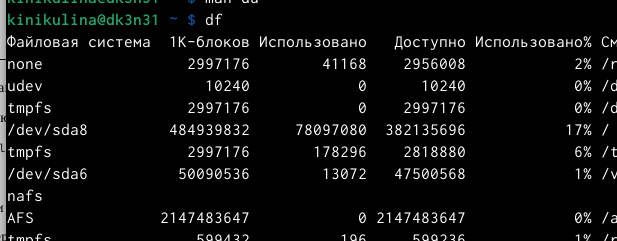{#fig:013 width=40%}

##

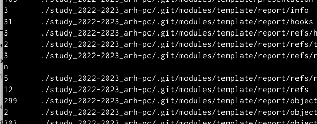{#fig:014 width=40%}

##

12. Выведем имена всех директорий, которые имеются в домашнем каталоге, предварительно узнаем опции команды *find*.

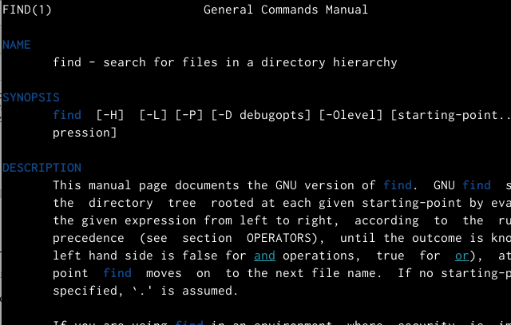{#fig:015 width=40%}

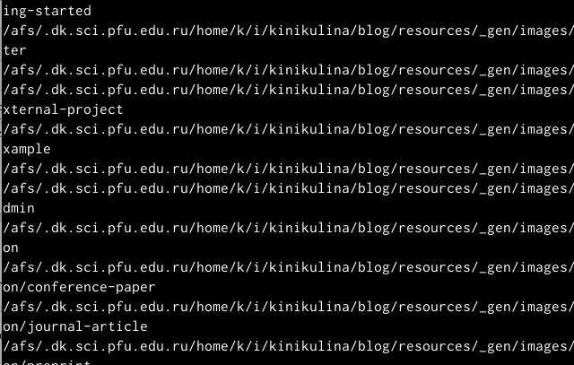{#fig:016 width=40%}

# Выводы

В ходе выполнения данной лабораторной работы я ознакомилась с инструментами поиска файлов и фильтрации текстовых данных, а также приобрела практические навыки по управлению процессами, по проверке использования диска и обслуживанию файловых систем.

