---
## Front matter
title: "Отчет по лабораторной работе № 7"
subtitle: "Операционные системы"
author: "Никулина Ксения Ильинична"

## Generic otions
lang: ru-RU
toc-title: "Содержание"

## Bibliography
bibliography: bib/cite.bib
csl: pandoc/csl/gost-r-7-0-5-2008-numeric.csl

## Pdf output format
toc: true # Table of contents
toc-depth: 2
lof: true # List of figures
fontsize: 12pt
linestretch: 1.5
papersize: a4
documentclass: scrreprt
## I18n polyglossia
polyglossia-lang:
  name: russian
  options:
	- spelling=modern
	- babelshorthands=true
polyglossia-otherlangs:
  name: english
## I18n babel
babel-lang: russian
babel-otherlangs: english
## Fonts
mainfont: PT Serif
romanfont: PT Serif
sansfont: PT Sans
monofont: PT Mono
mainfontoptions: Ligatures=TeX
romanfontoptions: Ligatures=TeX
sansfontoptions: Ligatures=TeX,Scale=MatchLowercase
monofontoptions: Scale=MatchLowercase,Scale=0.9
## Biblatex
biblatex: true
biblio-style: "gost-numeric"
biblatexoptions:
  - parentracker=true
  - backend=biber
  - hyperref=auto
  - language=auto
  - autolang=other*
  - citestyle=gost-numeric
## Pandoc-crossref LaTeX customization
figureTitle: "Рис."
tableTitle: "Таблица"
listingTitle: "Листинг"
lofTitle: "Список иллюстраций"
lolTitle: "Листинги"
## Misc options
indent: true
header-includes:
  - \usepackage{indentfirst}
  - \usepackage{float} # keep figures where there are in the text
  - \floatplacement{figure}{H} # keep figures where there are in the text
---

# Цель работы

Освоение основных возможностей командной оболочки Midnight Commander.
Приобретение навыков практической работы по просмотру каталогов и файлов;
манипуляций с ними

# Выполнение лабораторной работы

1. **Задание по mc**. Изучаем информацию о mc, вызвав в командной строке man mc.(рис. @fig:001).

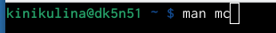{#fig:001 width=70%}

2. Запустим из командной строки mc и изучим его структуру и меню. Видим, что верхнее меню содержит “Левая панель”, “Файл”, “Команда”, “Настройки”, “Правая панель”. Также, начав клавиши F1 и F2 мы можем открыть “Помощь” или “Меню пользователя”.(рис. @fig:002),(рис. @fig:003),(рис. @fig:004).

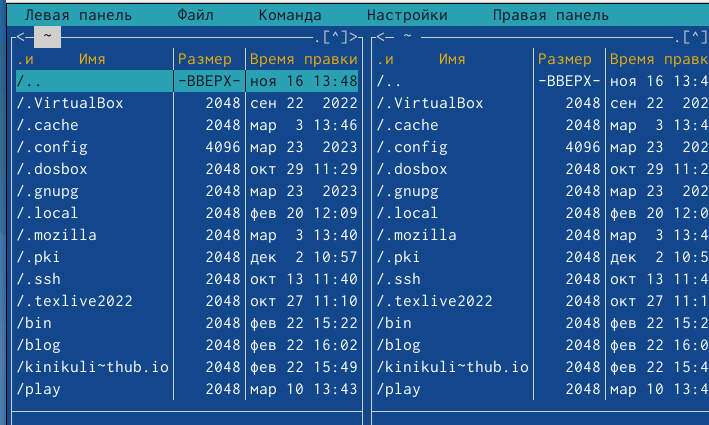{#fig:002 width=70%}

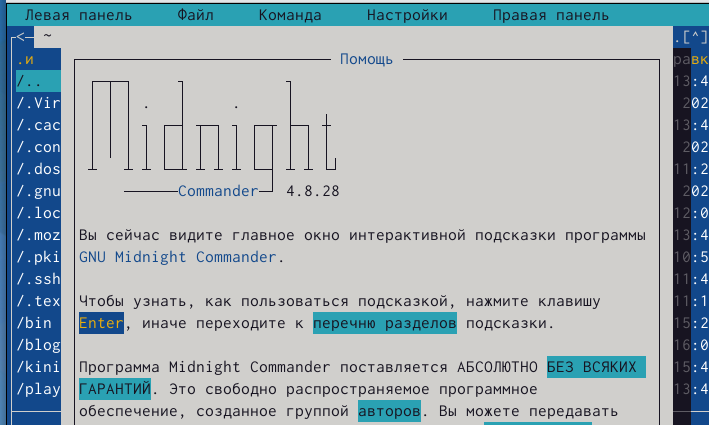{#fig:003 width=70%}

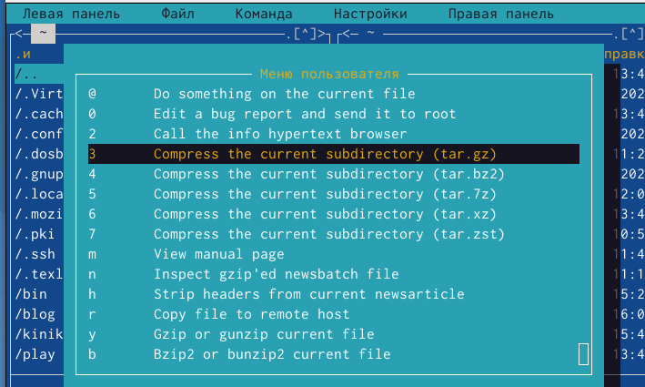{#fig:004 width=70%}

3. Выполним несколько операций в mc. Выделение и отмена выделения файлов. Для этого используем “shift”+стрелку вниз.(рис. @fig:005).

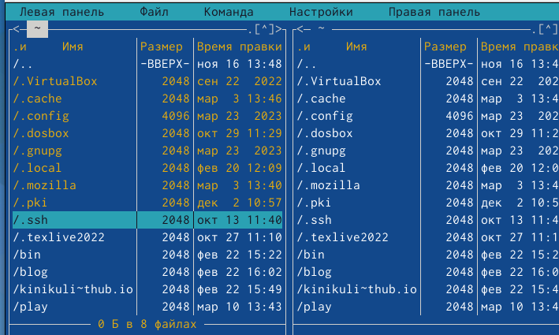{#fig:005 width=70%}

Копирование и перемещение файлов. Для копирования используем клафишу “F5”, а для перемещения “F6”.(рис. @fig:006), (рис. @fig:007).

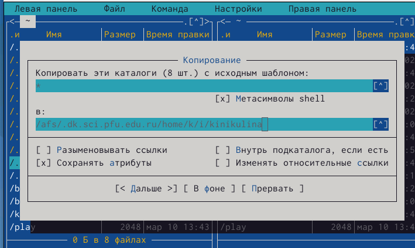{#fig:006 width=70%}

{#fig:007 width=70%}

После этого выполним команду для получения информации о размерах и правах доступа на файлы и/или каталоги. Это делаем таким путём: “Левая панель”-“Информация”.(рис. @fig:008),(рис. @fig:009).

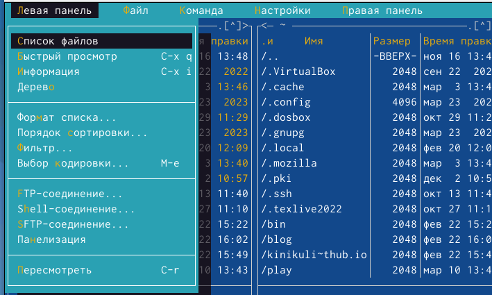{#fig:008 width=70%}

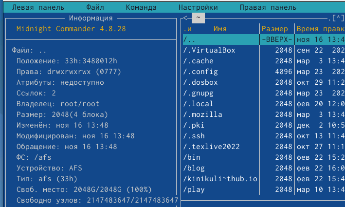{#fig:009 width=70%}

4. Выполним основные команды меню левой панели.(рис. @fig:010)

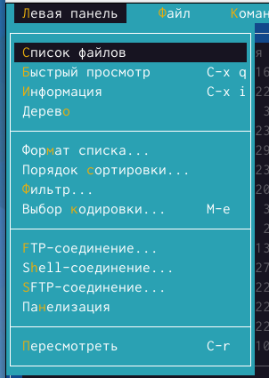{#fig:010 width=70%}

"Список файлов” отображает размер файла и время его правки.(рис. @fig:011)

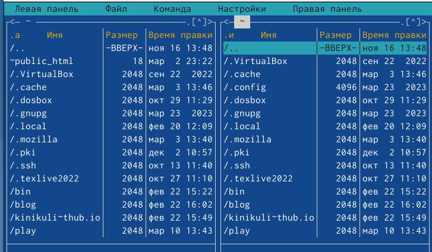{#fig:011 width=70%}

Быстрый просмотр” необходим для просмотра сожержания файлов. Пункт “Информация” отображает подробные данные для о файле.(рис. @fig:012)

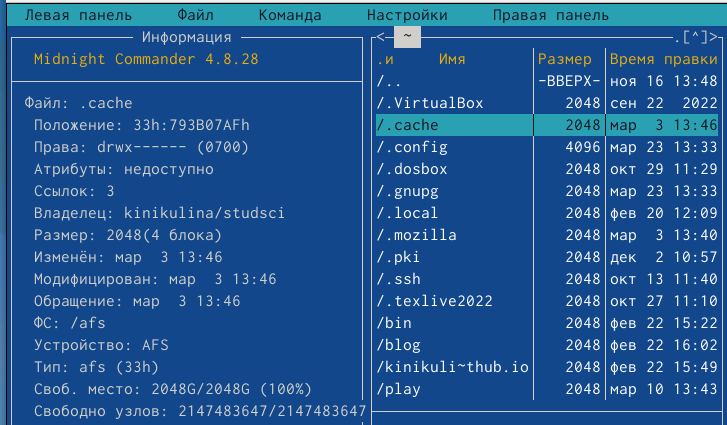{#fig:012 width=70%}

Пункт “Дерево” необходим для просмотра дерева каталога.(рис. @fig:013)

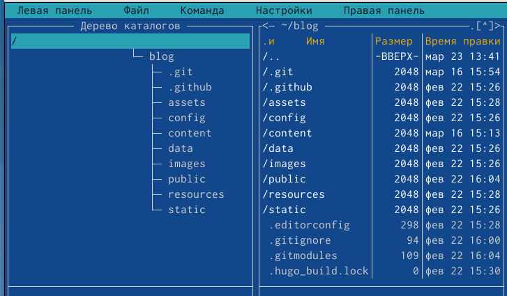{#fig:013 width=70%}

“Формат списка” (рис. @fig:014)

- “Укороченный” отображает только имя файла или каталога.

- “Расширенный” отображает подробную информацию о файлах.

- ”Определённый пользователем” даёт возможность самостоятельно изменять степень подробнотио файле. 

- “Стандартный” ставится по умолчанию. 

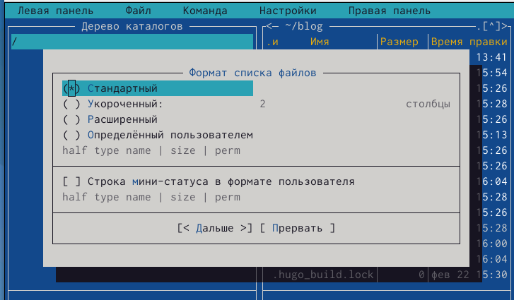{#fig:014 width=70%}

Пункт “Фильтр” необходим для того, чтобы просмотреть название файлов
или каталогов, которые подходят под указанную маску. “Порядок сортировки” необходим для сортировки файлов ил каталогов по конкретному критерию.

5. С помощью фозможностей подменю “Файл” выполним следующие действия. (рис. @fig:015)

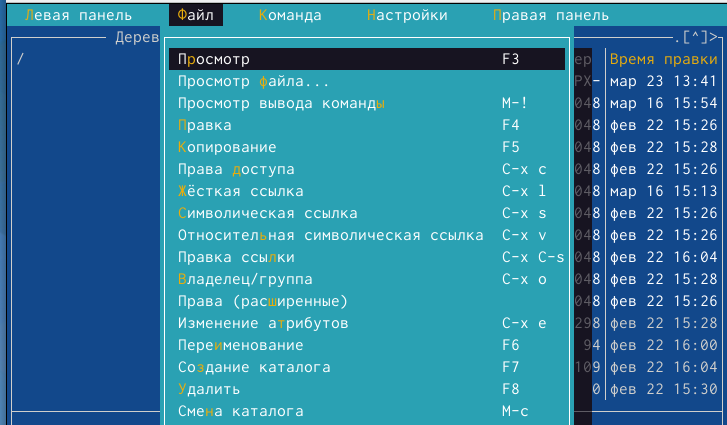{#fig:015 width=70%}

Для просмотра содержимого файла выберем пункт “Просмотр файла”. (рис. @fig:016)

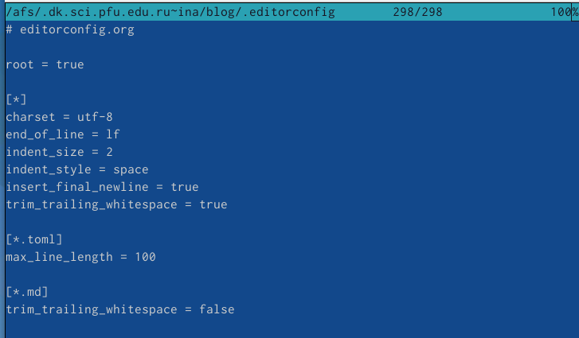{#fig:016 width=70%}

Для редактирования содержимого текстового файла перейдём в пункт “Правка” и изменим на “Hello”(рис. @fig:017)

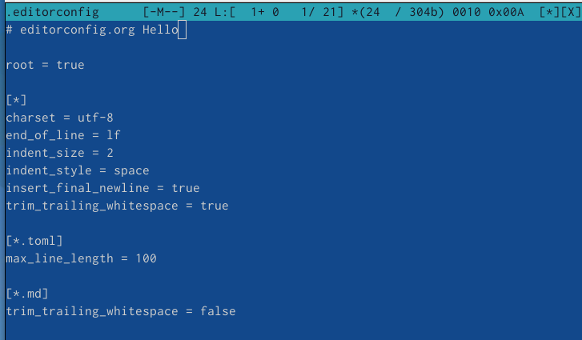{#fig:017 width=70%}

Для создания каталога переходим в пункт “Создание каталога”. Я создам каталог “Hello”(рис. @fig:018)

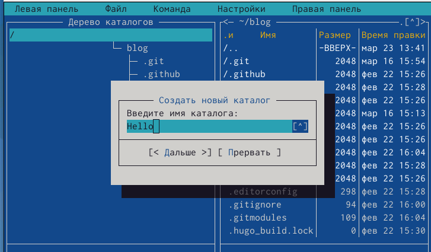{#fig:018 width=70%}

Копирование файлов в созданный каталог происходит с помощью выбора пункта “Копирование”. Выделим несколько файлов и пернесём их в каталог.(рис. @fig:019)

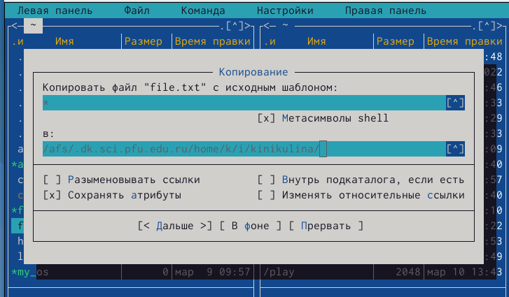{#fig:019 width=70%}

6. С помощью средств подменю “Команда” осуществим следующие действия:поиск в файловой системе файла с заданными условия. Задаим условия “От каталога /,”Шаблон имени”*.сpp, “Содержимое”main. (рис. @fig:020), (рис. @fig:021)

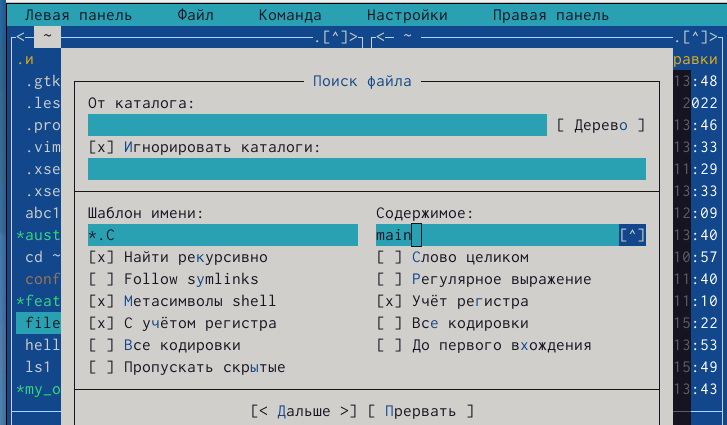{#fig:020 width=70%}

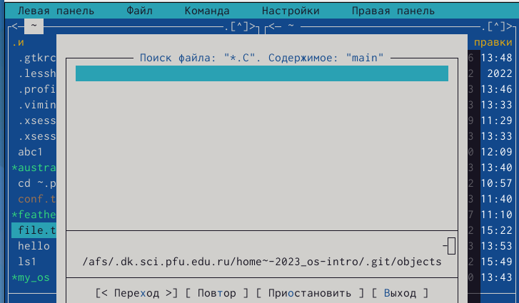{#fig:021 width=70%}

Затем для выбора и повторения одной из предыдущих комнад перейдём в
“История командной строки”-“История” внизу экрана, но это сноска пустая, т.к. не была использована командная строка.(рис. @fig:022)

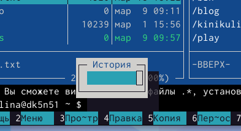{#fig:022 width=70%}

Для перехода в домашний каталог переходим в пункт “Дерево каталогов” и выбираем необходимый каталог. (рис. @fig:023)

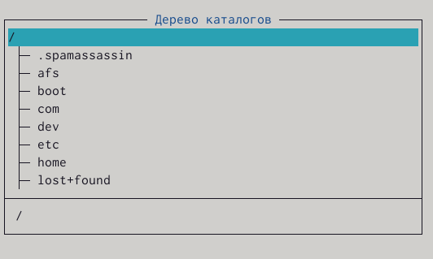{#fig:023 width=70%}

Для анализа файла меню и файла расширение переходим в пункт “Редактировать файл расширений(рис. @fig:024)

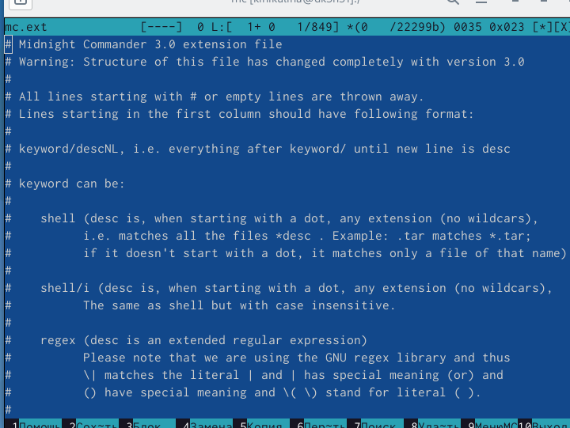{#fig:024 width=70%}

7. Вызовем подменю “Найстройки”. Освоим операции: “Конфигурация” позволяет скорректировать найстройки работы с панелями. “Внешний вид”-
“Настрйока панелей” помогают определить элементы, отображаемые при вызове mc. Пункт “Подтеждение” помогаем установить или убрать вывод окна с хапросом подтверждения действий при операциях удаления и перезаписи файлов. Пунк “Оформление” даёт возможность менять цветовую гамму визуальной оболочки. А с помощью пункта “Сохранить настройки”
сохраняем изменения.(рис. @fig:025)

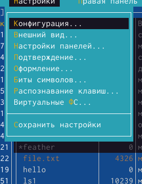{#fig:025 width=70%}
18)

{#
1. Создаём текстовый файл “text.txt”, командой “ls” проверяем выполнение действий. 

2. Открываем этот файл с помощью встроенного mc редактора с помощью команды “mcedit text.txt”.(рис. @fig:026)

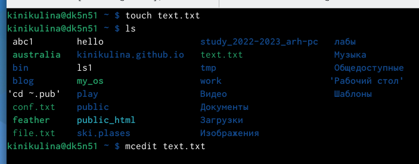{#fig:026 width=70%}

3. Вставим любой текстиз интернета и сделаем с ним следующие изменения.(рис. @fig:027)

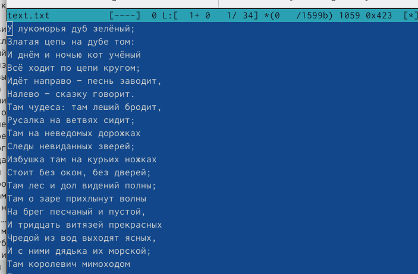{#fig:027 width=70%}

4. Удалим некую строчку стихотворения с помощью команды “F8”.(рис. @fig:028)

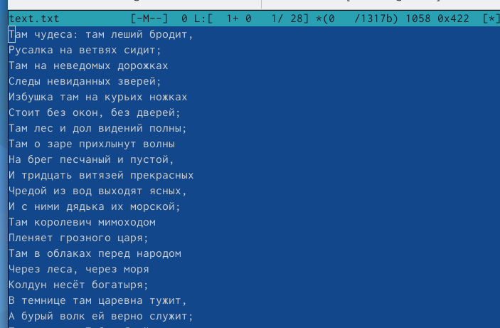{#fig:028 width=70%}

Выделим фрагмент текста с помощью “F3” и скопируем его на новую строку с помощью клавиши”F5”. (рис. @fig:029)

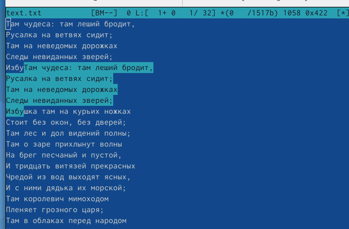{#fig:029 width=70%}

Сохраним файл с помощью клавиши “F2”.И отменим последнее действие с
помощью клавиш “ctrl+u”.(рис. @fig:030)

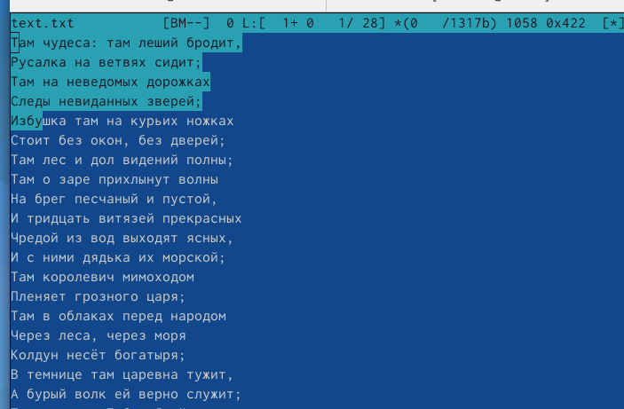{#fig:030 width=70%}

Для перехода в конец файла используем сочетание клавиш “ctrl+end”, и напишем автора стихотворения. (рис. @fig:031)

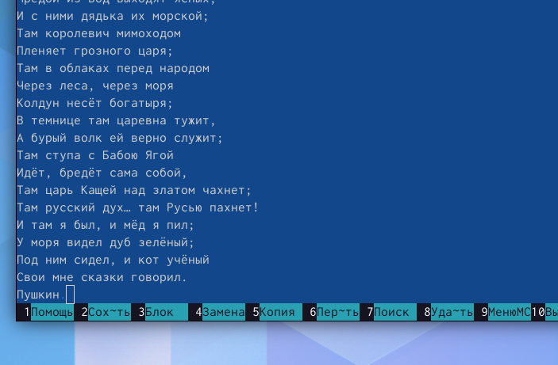{#fig:031 width=70%}

Для перехода в начало испольузем “ctrl+home” и напишем заголовок. (рис. @fig:032)

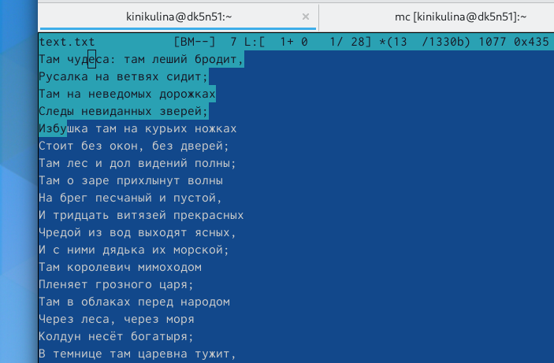{#fig:032 width=70%}

Сохраним и выйдем в konsole.

5. Откроем файл с исходным текстом на некотором языке прогроммирования.
Введём команду “find / -name *.java”(рис. @fig:033)

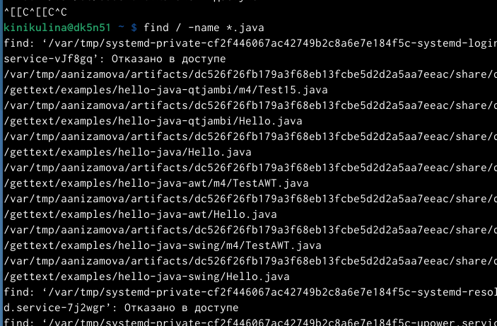{#fig:033 width=70%}

6. Используя меню редактора “Команда” - ” Отключить панели” мы можем включить/выключить подсветку строки.(рис. @fig:034)

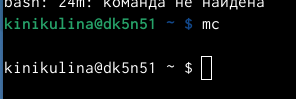{#fig:034 width=70%}

# Выводы
