---
## Front matter
lang: ru-RU
title: Презентация по лабораторной работе №8
subtitle: Операционные системы
author:
  - Никулина Ксения Ильинична НММбд-02-22
institute:
  - Российский университет дружбы народов, Москва, Россия
date: 31 марта 2023

## i18n babel
babel-lang: russian
babel-otherlangs: english

## Formatting pdf
toc: false
toc-title: Содержание
slide_level: 2
aspectratio: 169
section-titles: true
theme: metropolis
header-includes:
 - \metroset{progressbar=frametitle,sectionpage=progressbar,numbering=fraction}
 - '\makeatletter'
 - '\beamer@ignorenonframefalse'
 - '\makeatother'
---

# Цель работы

Познакомиться с операционной системой Linux.Получить практические навыки работы с редактором vi,установленным по умолчанию практически во всех
дистрибутивах.

## Выполнение лабораторной работы

 **Задание №1**
 
1. . Создаём каталог с именем *~/work/os/lab06* с помощью команды “mkdir -p work/os/lab06”, где -p даёт возмоность создать все каталоги, которые указаны внутри пути.

2. Переходим в наш созданный каталог с помощь “cd”.

##

3. Вызовываем vi и создаём файл hello.sh.
 
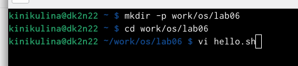{#fig:001 width=30%}

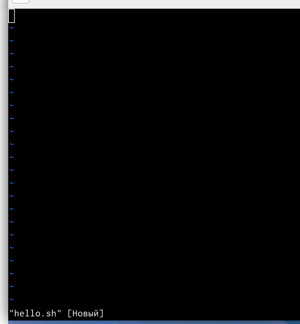{#fig:002 width=30%}

##

4. Нажимаем клавишу “i” и вводим текст, данный в лабораторной работе. 

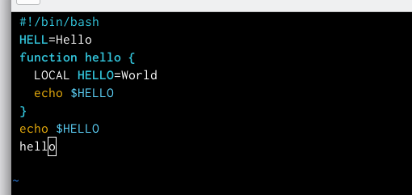{#fig:003 width=40%}

##

5. Нажимаем *esc* для выхода и перехода в командный режим.

{#fig:004 width=40%}

##

6. Для перехода в режим последней строки используем “:” и внизу экрана видим, что появилось двоеточие.

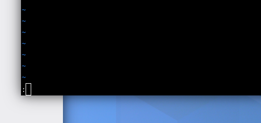{#fig:005 width=40%}

##

7. Для записи нажимаем “w” и “q” для выхода, далее “enter” для сохранение текста и завершения работы.

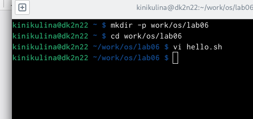{#fig:006 width=40%}

##

8. Сделаем наш файл исполняемым. Для этого используем команду “chmod +x hello.sh”.

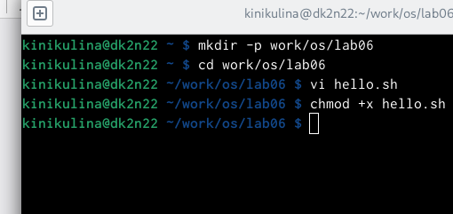{#fig:007 width=50%}

##

**Задание 2**

1. Вызовем vi на редактирование файла с помощью команды *vi ~/work/os/lab06/hello.sh*.

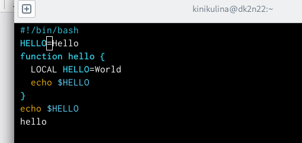{#fig:008 width=70%}

##

2. Установим курсор в конце слова “HELL” второй строки.

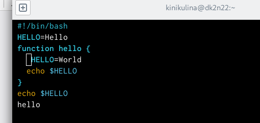{#fig:009 width=40%}

##

3. Переходим в режим вставки с помощью “i” и заменил “HELL” на “HELLO”..

{#fig:010 width=40%}

##

4. Установим курсор на четвёртую строку и сортём слово “LOCAL”, с помощью комбинации “d”, “w”, что означает “delete world”.

{#fig:011 width=40%}

##

5. Переходим в режим вставки и наберём текст “local”. Затем, нажимаем “esc” для возврата в командный режим.

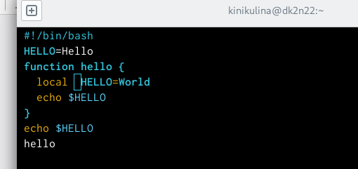{#fig:012 width=40%}

##

6. Установим курсор на последней строке файла и вставим строку со следующим текстом: “echo $HELLO”

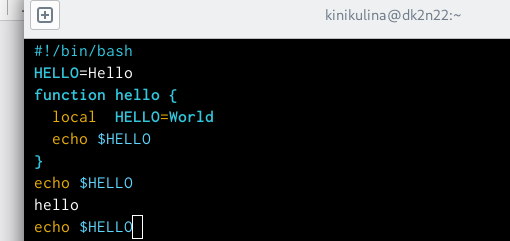{#fig:013 width=40%}

##

7. Нажимаем “esc” для перехода в командный режим.

8. Удаляем последнюю строку используя комбинацию клавиш используя сочетание клавиш “d”,“d”

{#fig:014 width=40%}

##

9. Введём команду отмены изменение (последней команды) : “u”.

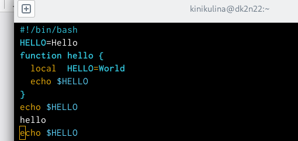{#fig:015 width=40%}

##

10. Переходим в режим последней строки с помощью “:”, записываем изменения, сохраняем и выходим в помощью “w”, “q” и “enter”. 

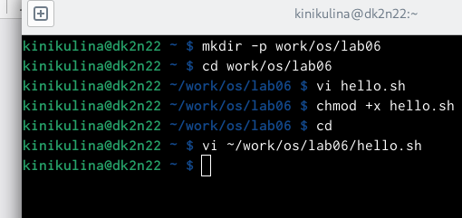{#fig:016 width=40%}

# Выводы

В ходе выполнения данной лабораторной работы я познакомилась с операционной системой Linux и получила практические навыки работы с редактором vi

