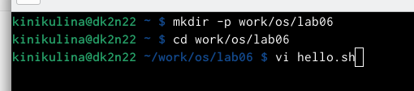
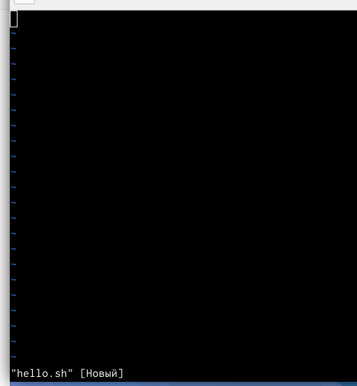
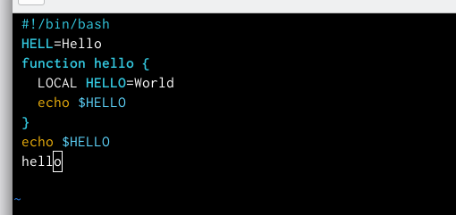
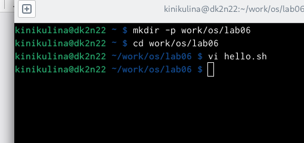
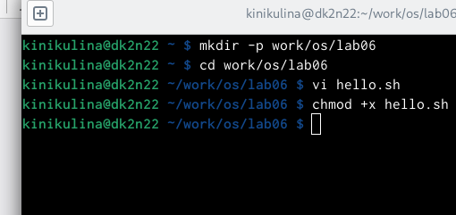
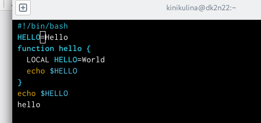
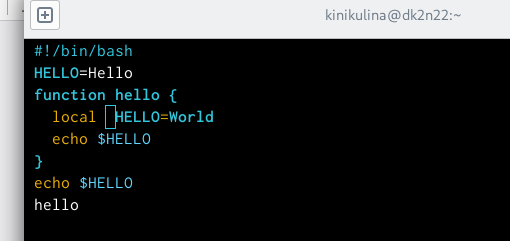
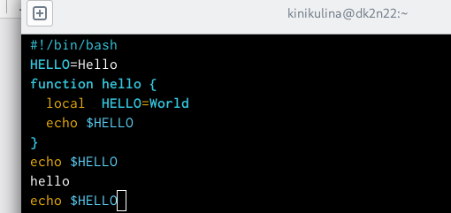
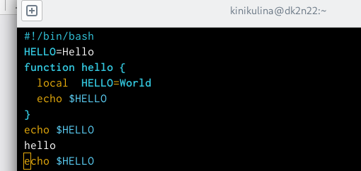
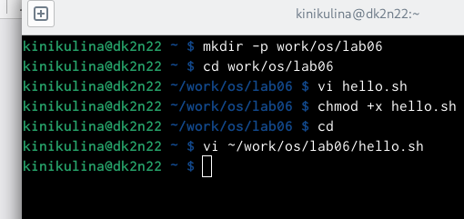

---
## Front matter
title: "Отчёт по лабораторной работе №8"
subtitle: "Операционные системы"
author: "Никулина Ксения Ильинична"

## Generic otions
lang: ru-RU
toc-title: "Содержание"

## Bibliography
bibliography: bib/cite.bib
csl: pandoc/csl/gost-r-7-0-5-2008-numeric.csl

## Pdf output format
toc: true # Table of contents
toc-depth: 2
lof: true # List of figures
lot: true # List of tables
fontsize: 12pt
linestretch: 1.5
papersize: a4
documentclass: scrreprt
## I18n polyglossia
polyglossia-lang:
  name: russian
  options:
	- spelling=modern
	- babelshorthands=true
polyglossia-otherlangs:
  name: english
## I18n babel
babel-lang: russian
babel-otherlangs: english
## Fonts
mainfont: PT Serif
romanfont: PT Serif
sansfont: PT Sans
monofont: PT Mono
mainfontoptions: Ligatures=TeX
romanfontoptions: Ligatures=TeX
sansfontoptions: Ligatures=TeX,Scale=MatchLowercase
monofontoptions: Scale=MatchLowercase,Scale=0.9
## Biblatex
biblatex: true
biblio-style: "gost-numeric"
biblatexoptions:
  - parentracker=true
  - backend=biber
  - hyperref=auto
  - language=auto
  - autolang=other*
  - citestyle=gost-numeric
## Pandoc-crossref LaTeX customization
figureTitle: "Рис."
tableTitle: "Таблица"
listingTitle: "Листинг"
lofTitle: "Список иллюстраций"
lotTitle: "Список таблиц"
lolTitle: "Листинги"
## Misc options
indent: true
header-includes:
  - \usepackage{indentfirst}
  - \usepackage{float} # keep figures where there are in the text
  - \floatplacement{figure}{H} # keep figures where there are in the text
---

# Цель работы

Познакомиться с операционной системой Linux.Получить практические навыки работы с редактором vi,установленным по умолчанию практически во всех
дистрибутивах.

# Выполнение лабораторной работы

 **Задание №1**
 
1. . Создаём каталог с именем *~/work/os/lab06* с помощью команды “mkdir -p work/os/lab06”, где -p даёт возмоность создать все каталоги, которые указаны внутри пути.

2. Переходим в наш созданный каталог с помощь “cd”.

3. Вызовываем vi и создаём файл hello.sh.(рис. @fig:001), (рис. @fig:002).
 
{#fig:001 width=70%}

{#fig:002 width=70%}

4. Нажимаем клавишу “i” и вводим текст, данный в лабораторной работе. (рис. @fig:003).

{#fig:003 width=40%}

5. Нажимаем *esc* для выхода и перехода в командный режим.(рис. @fig:004).

{#fig:004 width=40%}

6. Для перехода в режим последней строки используем “:” и внизу экрана видим, что появилось двоеточие.(рис. @fig:005).

{#fig:005 width=40%}

7. Для записи нажимаем “w” и “q” для выхода, далее “enter” для сохранение текста и завершения работы.(рис. @fig:006).

{#fig:006 width=40%}

8. Сделаем наш файл исполняемым. Для этого используем команду “chmod +x hello.sh”.(рис. @fig:007).

{#fig:007 width=70%}

**Задание 2**

1. Вызовем vi на редактирование файла с помощью команды *vi ~/work/os/lab06/hello.sh*.(рис. @fig:008).

{#fig:008 width=70%}

2. Установим курсор в конце слова “HELL” второй строки.(рис. @fig:009).

{#fig:009 width=40%}

3. Переходим в режим вставки с помощью “i” и заменил “HELL” на “HELLO”.(рис. @fig:010).

{#fig:010 width=40%}

4. Установим курсор на четвёртую строку и сортём слово “LOCAL”, с помощью комбинации “d”, “w”, что означает “delete world”.(рис. @fig:011).

{#fig:011 width=40%}

5. Переходим в режим вставки и наберём текст “local”. Затем, нажимаем “esc” для возврата в командный режим.(рис. @fig:012).

{#fig:012 width=40%}

6. Установим курсор на последней строке файла и вставим строку со следующим текстом: “echo $HELLO”(рис. @fig:013).

{#fig:013 width=40%}

7. Нажимаем “esc” для перехода в командный режим.

8. Удаляем последнюю строку используя комбинацию клавиш используя сочетание клавиш “d”,“d”.(рис. @fig:014).

{#fig:014 width=40%}

9. Введём команду отмены изменение (последней команды) : “u”.(рис. @fig:015).

{#fig:015 width=40%}

10. Переходим в режим последней строки с помощью “:”, записываем изменения, сохраняем и выходим в помощью “w”, “q” и “enter”. (рис. @fig:016).

{#fig:016 width=40%}

# Выводы

В ходе выполнения данной лабораторной работы я познакомилась с операционной системой Linux и получила практические навыки работы с редактором vi

# Ответы на контрольные вопросы

1. Редактор vi имеет три режима работы:
- командный режим − предназначен для ввода команд редактирования и
навигации по редактируемому файлу;
- режим вставки − предназначен для редактируемого файла;
- режим последней (или командной) строки − используется для записи изме-
нений в файл и выхода из редактора.

2. Чтобы выйти из редактора, не сохраняя произведённые изменения, нужно
в режиме командной строки нажать клавиши «:» «q» «!»

3. Команды позиционирования:
- «0» (ноль) − переход в начало строки;
- «$» − переход в конец строки;
- «G» − переход в конец файла;
- n«G» − переход на строку с номером n.

4. При использовании прописных W и B под разделителями понимаются толь-
ко пробел, табуляция и возврат каретки. При использовании строчных w и
b под разделителями понимаются также любые знаки пунктуации.

5. Чтобы из любого места редактируемого файла перейти в начало (конец)
файла, нужно в режиме командной строки нажать клавиши «1» «G» («G»).

6. Команды редактирования: 

Вставка текста
- а» − вставить текст после курсора;
- «А» − вставить текст в конец строки;
- «i» − вставить текст перед курсором;
- n «i» − вставить текст n раз;
- «I» − вставить текст в начало строки. Вставка строки
- «о» − вставить строку под курсором;
- «О» − вставить строку над курсором. Удаление текста
- «x» − удалить один символ в буфер;
- «d» «w» − удалить одно слово в буфер;
- «d» «$» − удалить в буфер текст от курсора до конца строки;
- «d» «0» − удалить в буфер текст от начала строки до позиции курсора;
- «d» «d» − удалить в буфер одну строку; n «d» «d» − удалить в буфер n строк.

Отмена и повтор произведённых изменений
- «u» − отменить последнее изменение;
- «.» − повторить последнее изменение. Копирование текста в буфер
- «Y» − скопировать строку в буфер;
- n «Y» − скопировать n строк в буфер;
- «y» «w» − скопировать слово в буфер. Вставка текста из буфера
- «p» − вставить текст из буфера после курсора;
- «P» − вставить текст из буфера перед курсором. Замена текста
- «c» «w» − заменить слово;
- n «c» «w» − заменить n слов;
- «c» «$» − заменить текст от курсора до конца строки;
- «r» − заменить слово;
- «R» − заменить текст. Поиск текста
- «/» текст − произвести поиск вперёд по тексту указанной строки символов текст;
- «?» текст − произвести поиск назад по тексту указанной строки символов
текст. 

Копирование и перемещение текста
- «:» n,m «d» – удалить строки с n по m;
- «:» i,j «m» k – переместить строки с i по j, начиная со строки k;
-  «:» i,j «t» k – копировать строки с i по j в строку k;
- «:» i,j «w» имя-файла – записать строки с i по j в файл с именем имя-файла.

7. Чтобы заполнить строку символами , n«G», n–, «0».«c»«», чтобы заменить текст от курсора до конца строки, и ввести символы $.

8. Чтобы отменить по одному предыдущему действию последовательно, необ-
ходимо нажать «u». Чтобы отменить все изменения, произведённые со
времени последней записи, нужно нажать «:» «e» «!».

9. Команды редактирования в режиме командной строки Копирование и пе-
ремещение текста
- «:» n,m «d» − удалить строки с n по m;
- «:» i,j «m» k − переместить строки с i по j, начиная со строки k;
- «:» i,j «t» k − копировать строки с i по j в строку k;
- «:» i,j «w» имя-файла − записать строки с i по j в файл с именем имя-файла.

Запись в файл и выход из редактора
- «:» «w» − записать изменённый текст в файл, не выходя из vi;
- «:» «w» имя-файла − записать изменённый текст в новый файл с именем имя-файла;
- «:» «w» «!» имя-файла − записать изменённый текст в файл с именем имя-
файла;
- «:» «w» «q» − записать изменения в файл и выйти из vi;
- «:» «q» − выйти из редактора vi;
- «:» «q» «!» − выйти из редактора без записи;
- «:» «e» «!» − вернуться в командный режим, отменив все изменения, произведённые со времени последней записи. Опции Опции редактора vi позволяют настроить рабочую среду. Для задания опций используется команда set (в режиме последней строки):
- «:» set all − вывести полный список опций;
- «:» set nu − вывести номера строк;
- «:» set list − вывести невидимые символы;
- «:» set ic − не учитывать при поиске, является ли символ прописным или
строчным. Если вы хотите отказаться от использования опции, то в команде
set перед именем опции надо поставить no.

10. Чтобы определить, не перемещая курсора, позицию, в которой заканчива-
ется строка, нужно в командном режиме находясь на нужной строке нажать «$»
и посмотреть на число после запятой в правом нижнем углу экрана

11. Опции редактора vi позволяют настроить рабочую среду. Для задания оп-
ций используется команда set (в режиме командной строки). Если вы хотите
отказаться от использования опции, то в команде set перед именем опции
надо поставить no. Чтобы просмотреть опции редактора vi, необходимо на-
жать «:» set all. Нажав «:» help “название_опции”, можно узнать назначение
конкретной опции.

12. В режиме командной строки внизу редактора присутствует «:», в режиме
ввода – «– ВСТАВКА –», в командном режиме внизу ничего нет.

