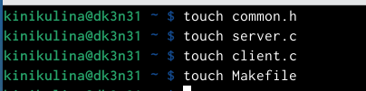
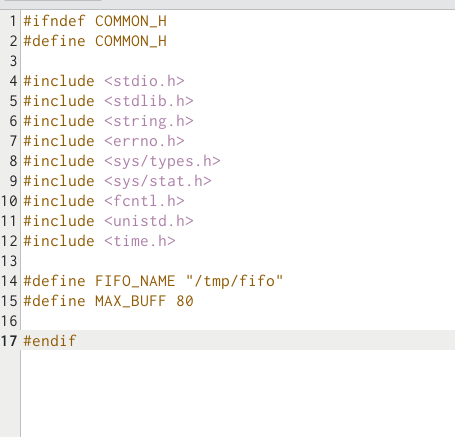
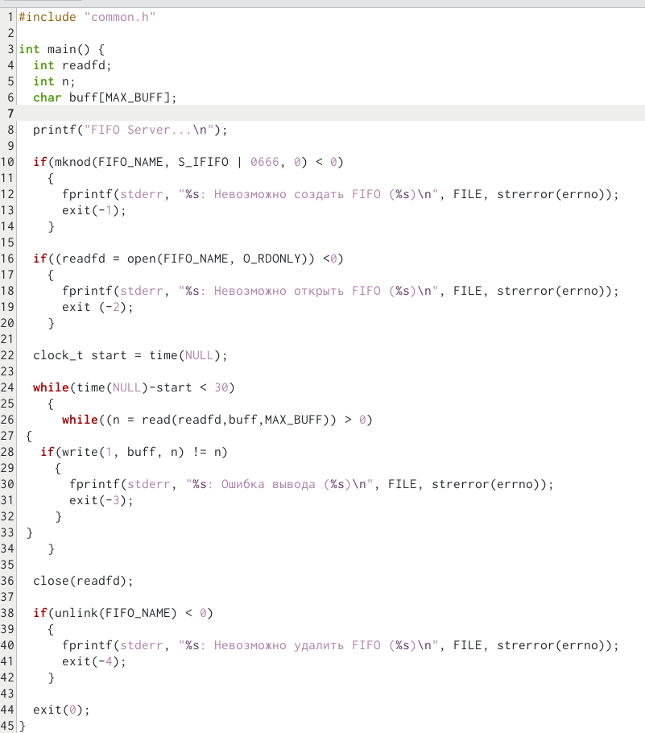
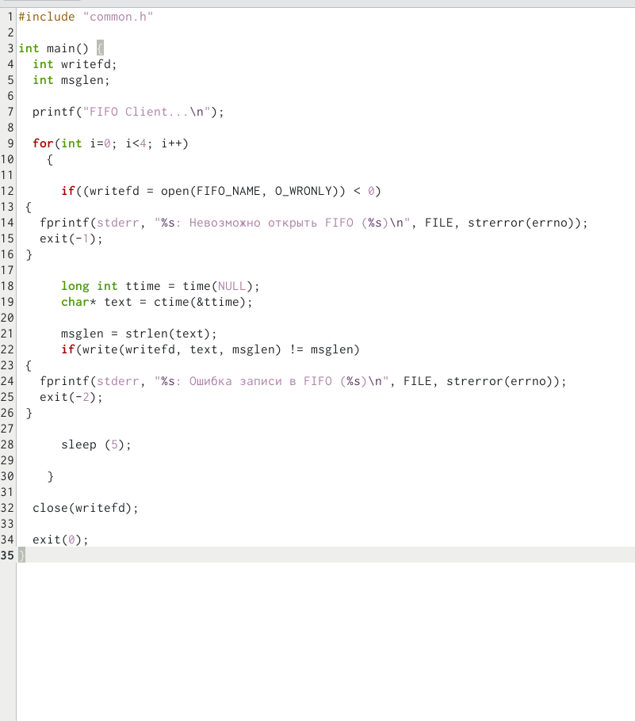
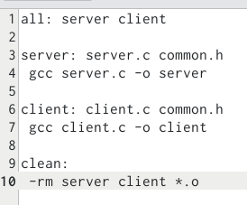

---
## Front matter
lang: ru-RU
title: Презентация по лабораторной работе №14
subtitle: Операционные системы
author:
  - Никулина Ксения Ильинична
institute:
  - Российский университет дружбы народов, Москва, Россия
date: 12 мая 

## i18n babel
babel-lang: russian
babel-otherlangs: english

## Formatting pdf
toc: false
toc-title: Содержание
slide_level: 2
aspectratio: 169
section-titles: true
theme: metropolis
header-includes:
 - \metroset{progressbar=frametitle,sectionpage=progressbar,numbering=fraction}
 - '\makeatletter'
 - '\beamer@ignorenonframefalse'
 - '\makeatother'
---
---
# Цель работы

Приобретение практических навыков работы с именованными каналами

# Задание 

Изучить приведённые в тексте программы server.c и client.c. Взяв данные примеры
за образец, напишите аналогичные программы, внеся следующие изменения:

1. Работает не 1 клиент, а несколько (например, два).

2. Клиенты передают текущее время с некоторой периодичностью (например, раз в пять
секунд). Используйте функцию sleep() для приостановки работы клиента.

3. Сервер работает не бесконечно, а прекращает работу через некоторое время (например, 30 сек). Используйте функцию clock() для определения времени работы сервера. Что будет в случае, если сервер завершит работу, не закрыв канал?

# Выполнение лабораторной работы

Для начала изучили материал лабораторной работы. Далее на основе примеров напишем аналогичные программы, но с изменениями.

1. Для начала создадим необходимые файлы для работы. 

{#fig:001 width=50%}

##

Затем изменим коды программ, данных в лабораторной работе. В файл *common.h* добавим стандартные заголовочные файлы: "unistd.h", "time.h". Это необходимо для работы других файлов. Этот файл является заголовочным, чтобы в остальных програмах не прописывать одно и то же каждый раз.

{#fig:002 width=40%}
##

2. Затем в файл *server.c* добавляем цикл "while" для контроля за верменем работы сервера. Разница между текущим временем и началом работы не должна превышать 30 секунд.

{#fig:003 width=40%}

##

3. В файл *client.c* добавим цикл, который отвечает за количество сообщений о текущем времени (4 сообщения). С промощью команды "sleep" приостановим работу клиента на 5 секунд.

{#fig:004 width=40%}
##

Makefile оставили без изменений

{#fig:005 width=40%}
##

Далее делаем компиляцию файлов с помощью команды "make all".. 

{#fig:006 width=40%}
##
Затем открываем три терминала для проверки работы наших файлов. В первом пишем "./server", а в остальных "./client". В результате каждый терминал вывел по 4 сообщения, а по истечение 30 секунд работа сервера была завершена. Всё работает верно.

{#fig:007 width=40%} 

# Выводы

В ходе выполнения данной лабораторной работы я приобрела навыки работы с очередями сообщений.

