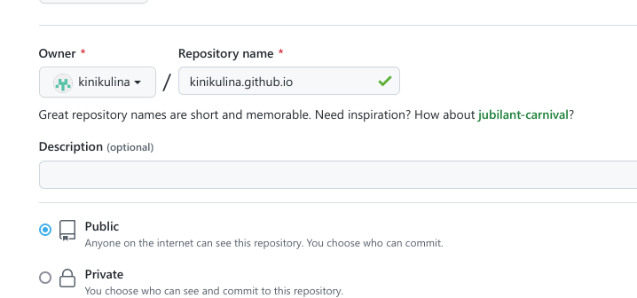

---
## Front matter
lang: ru-RU
title: Отчет по первому этапу индивидуального проекта
subtitle: Дисциплина "Операционные системы"
author:
  - Никулина Ксения Ильинична
institute:
  - Российский университет дружбы народов, Москва, Россия
date: 21 февраля 2023

## i18n babel
babel-lang: russian
babel-otherlangs: english

## Formatting pdf
toc: false
toc-title: Содержание
slide_level: 2
aspectratio: 169
section-titles: true
theme: metropolis
header-includes:
 - \metroset{progressbar=frametitle,sectionpage=progressbar,numbering=fraction}
 - '\makeatletter'
 - '\beamer@ignorenonframefalse'
 - '\makeatother'
---

# Информация

## Докладчик

:::::::::::::: {.columns align=center}
::: {.column width="70%"}

  * Никулина Ксения Ильинична
  * НММбд-02-22
  * Российский университет дружбы народов
  

:::
::: {.column width="30%"}

:::
::::::::::::::

# Вводная часть

## Цели и задачи

Выполнение первого этапа.

## Архив

1. Скачала архив с репозитория. 

## Новая папка

2. Разархивировала, скопировала файл hugo и поместила его в в новую папку bin. 

## Новый репозиторий

3. Создала новый репозиторий с шаблона и клонировала его.

## Клонирование

## Пример сайта

## Новый репозиторий

6. Создала еще один новый репозиторий с названием "evthankina.github.io" 

## Клонирование

7. Клонировала этот репозиторий.

## Новая ветка

8. Создала новую ветку main, а также создала файл README.md 

## Присоединение

9. Присоединили новый репозиторий к папке public. 
Нам выдали ошибку, поэтому мы поставили "#" возле public, чтобы исправить ошибку и повторили команду.

## Новые файлы

10.  Введя "~/bin/hugo" появились новые файлы. Перенесли их и на github.

## Полученный сайт 

11. Сайт с названием 

# Вывод

Я научилась работать с github и hugo.
