---
## Front matter
title: "Отчет"
subtitle: "Первый этап индивидульного проекта"
author: "Никулина Ксения Илинична"

## Generic otions
lang: ru-RU
toc-title: "Содержание"

## Bibliography
bibliography: bib/cite.bib
csl: pandoc/csl/gost-r-7-0-5-2008-numeric.csl

## Pdf output format
toc: true # Table of contents
toc-depth: 2
lof: true # List of figures
lot: true # List of tables
fontsize: 12pt
linestretch: 1.5
papersize: a4
documentclass: scrreprt
## I18n polyglossia
polyglossia-lang:
  name: russian
  options:
	- spelling=modern
	- babelshorthands=true
polyglossia-otherlangs:
  name: english
## I18n babel
babel-lang: russian
babel-otherlangs: english
## Fonts
mainfont: PT Serif
romanfont: PT Serif
sansfont: PT Sans
monofont: PT Mono
mainfontoptions: Ligatures=TeX
romanfontoptions: Ligatures=TeX
sansfontoptions: Ligatures=TeX,Scale=MatchLowercase
monofontoptions: Scale=MatchLowercase,Scale=0.9
## Biblatex
biblatex: true
biblio-style: "gost-numeric"
biblatexoptions:
  - parentracker=true
  - backend=biber
  - hyperref=auto
  - language=auto
  - autolang=other*
  - citestyle=gost-numeric
## Pandoc-crossref LaTeX customization
figureTitle: "Рис."
tableTitle: "Таблица"
listingTitle: "Листинг"
lofTitle: "Список иллюстраций"
lotTitle: "Список таблиц"
lolTitle: "Листинги"
## Misc options
indent: true
header-includes:
  - \usepackage{indentfirst}
  - \usepackage{float} # keep figures where there are in the text
  - \floatplacement{figure}{H} # keep figures where there are in the text
---

# Цель работы

- Установить необходимое программное обеспечение.
- Скачать шаблон темы сайта.
- Разместить его на хостинге git.
- Установить параметр для URLs сайта.
- Разместить заготовку сайта на Github pages.

# Выполнение лабораторной работы

1. Скачала архив с репозитория. (рис. [-@fig:001]).

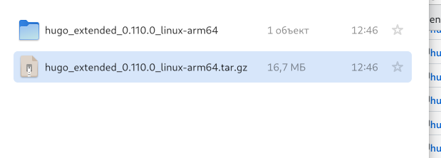{#fig:001 width=70%}

2. Разархивировала, скопировала файл hugo и поместила его в в новую папку bin. (рис. [-@fig:002])

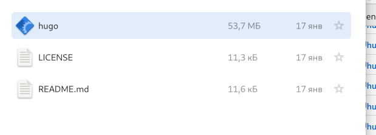{#fig:002 width=70%}

3. Создала новый репозиторий с шаблона и клонировала его.(рис. [- @fig:003], рис.[-@fig:004])

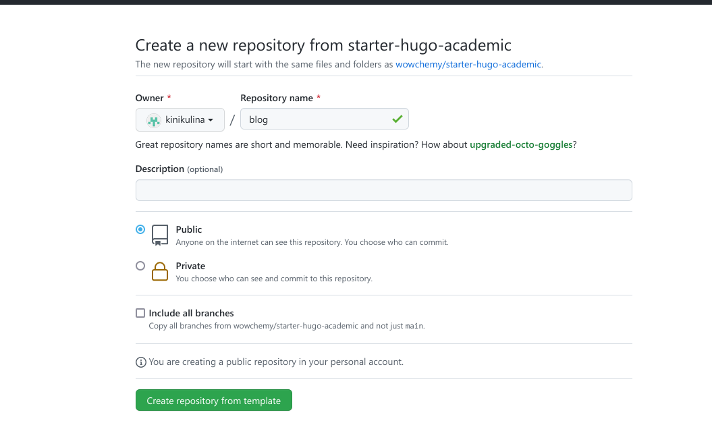{#fig:003 width=70%}

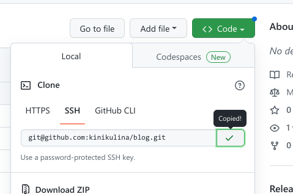{#fig:004 width=70%}

4. Перешла в blog и выполнила команду '~/bin/hugo'. После этого удалила public. (рис. @fig:005)

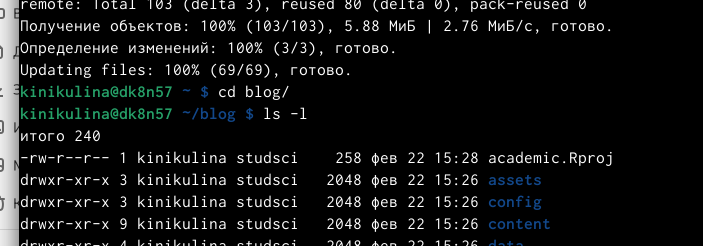{#fig:005 width=70%}

5. Ввела команду '~/bin/hugo server', чтобы получить ссылку на сайт.(рис. [-@fig:006])

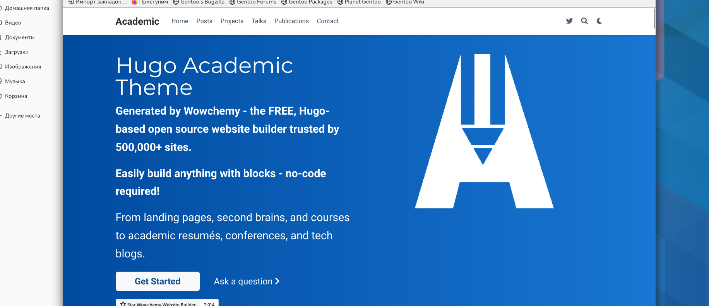{#fig:006 width=70%}

6. Создала еще один новый репозиторий с названием "kinikulina.github.io" (рис. [-@fig:007])

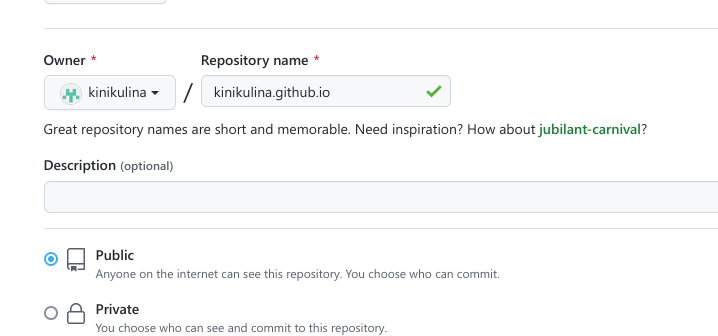{#fig:007 width=70%}

7. Клонировала этот репозиторий.(рис. [-@fig:008])

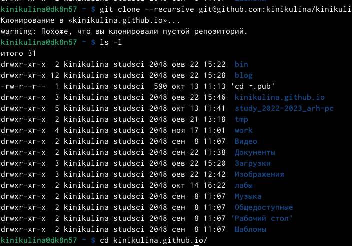{#fig:008 width=70%}

8. Создала новую ветку main, а также создала файл README.md (рис. [-@fig:009])

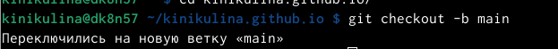{#fig:009 width=70%}

9. Присоединили новый репозиторий к папке public. Нам выдали ошибку, поэтому мы поставили "#" возле public, чтобы исправить ошибку и повторили команду (рис. [-@fig:010])

{#fig:010 width=70%}

10.  Введя "~/bin/hugo" появились новые файлы. Перенесли их и на github.(рис. [-@fig:011], рис. [-@fig:012]) 

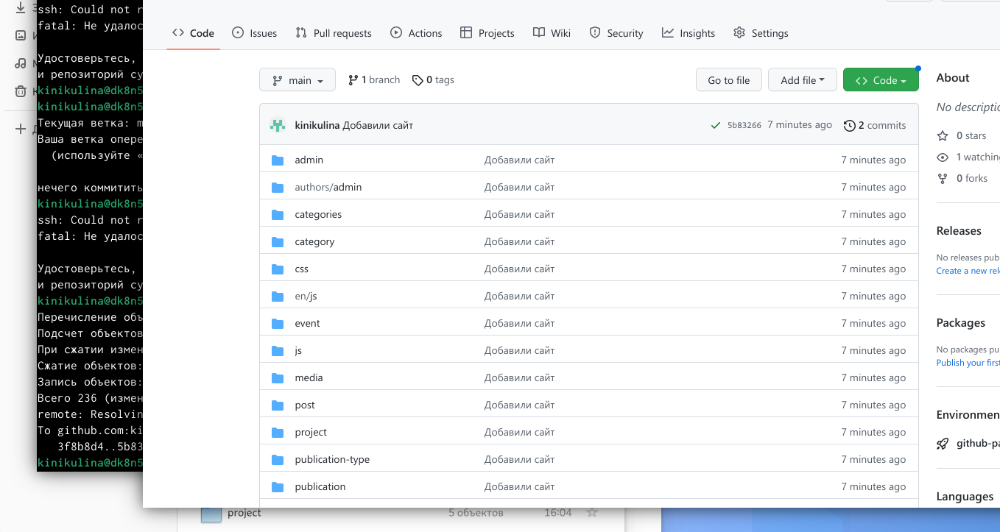{#fig:0011 width=70%}

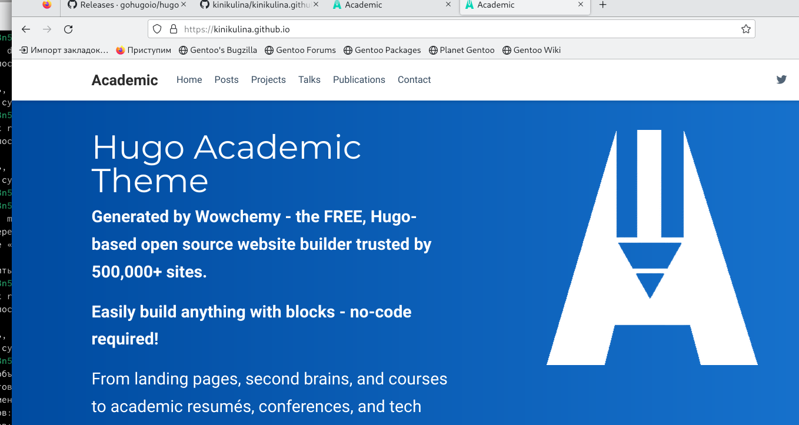{#fig:012 width=70%}

# Вывод

Я научилась работать с github и hugo.

