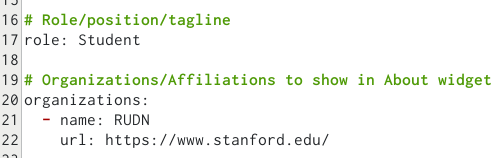
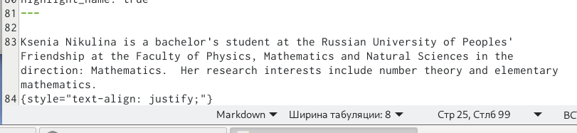
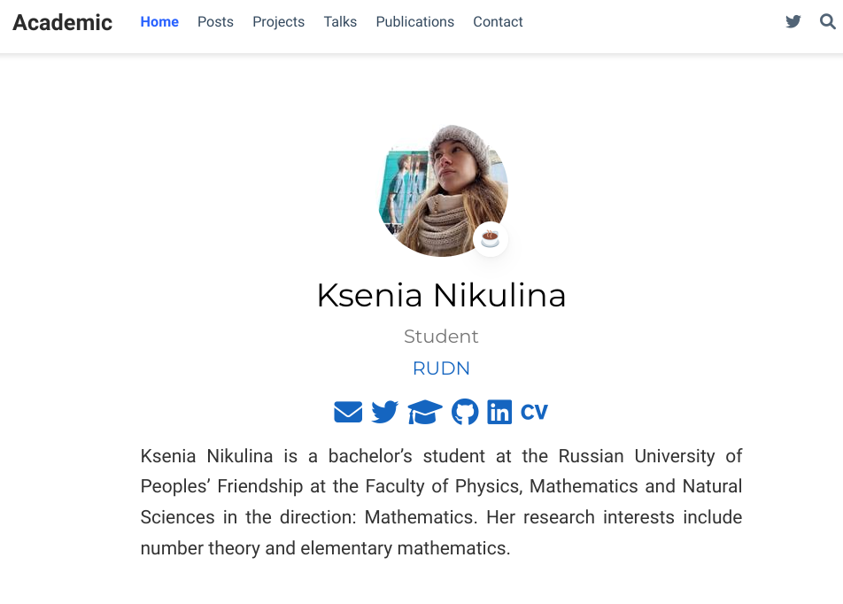
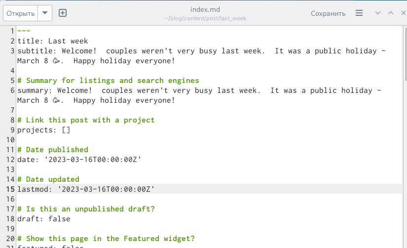
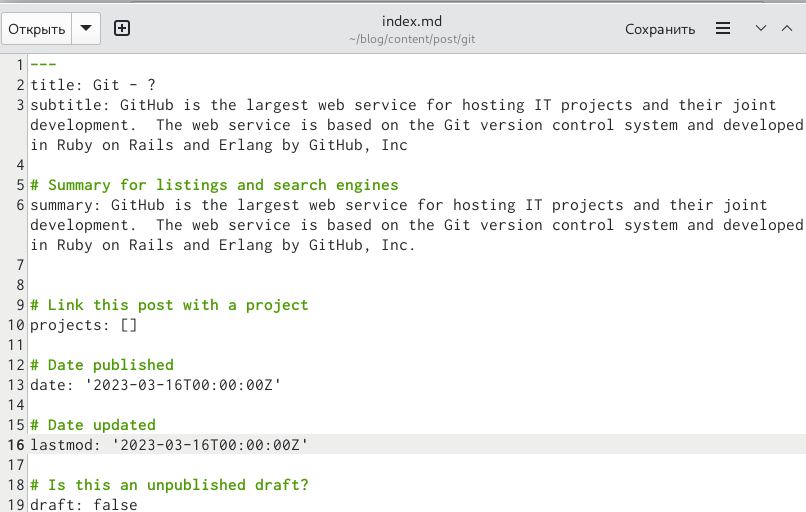
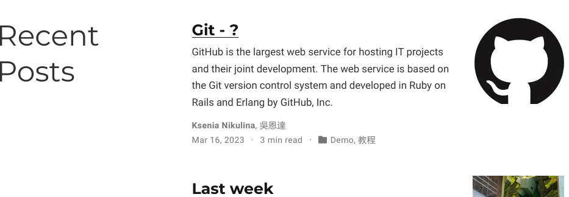
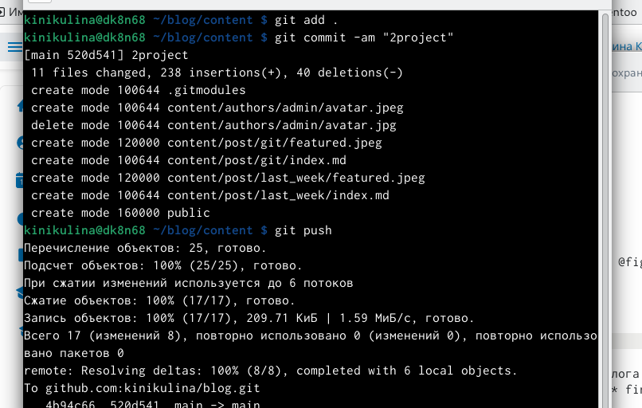

---
## Front matter
lang: ru-RU
title: Презентация по 2 этапу индивидуального проета
subtitle: Операционные системы
author:
  - Никулина Ксения Ильинична, НММбд-02-22
institute:
  - Российский университет дружбы народов, Москва, Россия
date: 13 марта 2023

## i18n babel
babel-lang: russian
babel-otherlangs: english

## Formatting pdf
toc: false
toc-title: Содержание
slide_level: 2
aspectratio: 169
section-titles: true
theme: metropolis
header-includes:
 - \metroset{progressbar=frametitle,sectionpage=progressbar,numbering=fraction}
 - '\makeatletter'
 - '\beamer@ignorenonframefalse'
 - '\makeatother'
---

# Цель работы

Написать информацию о владельце сайта, выложить посты - выполнить задания 2 этапа индивидуального проекта.

## Выполнение лабораторной работы

1. Зашли на страницу сайта с помощью команды hugo server 

2. Добавила данные о себе: разместила фотографию владельца сайта, разместила краткое описание владельца сайта (Biography), добавила информацию об интересах (Interests), добавила информацию от образовании (Education). 

{#fig:001 width=70%}

{#fig:002 width=70%}

{#fig:003 width=70%}

##

3. Сделала пост по прошедшей неделе 

{#fig:004 width=70%}

{#fig:005 width=70%}

## 

4. Добавила пост на тему по выбору: Управление версиями. Git. 

{#fig:006 width=70%}

{#fig:007 width=70%}

## 

5. Загрузила на гитхаб 

{#fig:008 width=40%}

# Выводы

Я узнала ка менять информацию на сайте и смогла загрузить информацию о себе. Также научилась выкладывать посты на сайте.

